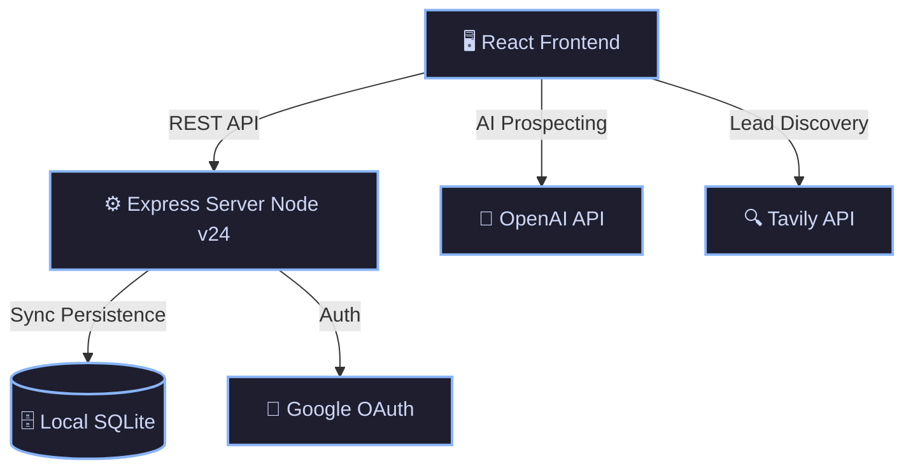

<div align="center">
  

  <h1>🚀 Apex CRM</h1>
  <p><strong>Next-Generation AI-Powered Sales & Prospecting Platform</strong></p>

  <p>
    
    
    
    
    
  </p>
</div>

---

## ✨ Overview

**Apex CRM** is a cutting-edge, local-first Customer Relationship Management tool designed for modern sales teams. It seamlessly integrates AI-driven prospecting, intelligent lead enrichment, and automated outreach drafting into a single, lightning-fast workspace.

By combining the power of an **OpenAI-compatible LLM** for content generation, **Tavily** for real-time web scraping, and a **Local SQLite** backend for immediate data persistence, Apex CRM eliminates the friction between finding a lead and closing a deal.

---

## 🛠️ Architecture & Tech Stack



### Core Technologies
- **Frontend**: React 19, TailwindCSS, Framer Motion (UI Animations), Lucide React (Icons)
- **Backend**: Express.js, TypeScript, Node.js v24
- **Database**: `node:sqlite` (Built-in Local-first DB, WAL mode)
- **Integrations**: OpenAI-compatible API (AI), Tavily (Search), Google OAuth (Authentication)

---

## 🚀 Key Features

| Feature | Description | Icon |
|---------|-------------|:---:|
| **Scrape Workspace** | Discover and enrich leads automatically using AI and Tavily search integration. | 🔍 |
| **CRM Pipeline** | Visual Kanban board to drag-and-drop leads through your sales funnel. | 📋 |
| **Inventory Table** | High-density data grid for managing and deduplicating your lead database. | 🗄️ |
| **Outreach Studio** | AI-generated, hyper-personalized email drafts based on lead profiles and intent. | ✉️ |
| **Local-First Speed** | Zero-latency UI with background syncing to a durable, local SQLite database. | ⚡ |

---

## 🚦 Getting Started

### Prerequisites
- **Node.js** (v24+ recommended for native SQLite support)
- API Keys for an **OpenAI-compatible LLM** and **Tavily** (optional but recommended)

### Installation

1. **Clone the repository and install dependencies:**
   ```bash
   npm install
   ```

2. **Configure your Environment:**
   Copy the `.env.example` file to `.env` and fill in your credentials.
   ```env
   OPENAI_API_KEY="your_openai_api_key"
   TAVILY_API_KEY="your_tavily_api_key"
   GOOGLE_CLIENT_ID="your_google_oauth_id"
   GOOGLE_CLIENT_SECRET="your_google_oauth_secret"
   APEX_DB_PATH=".apex-data/apex-crm.sqlite"
   ```

3. **Start the Development Server:**
   ```bash
   npm run dev
   ```
   *The app will launch at `http://localhost:3000` with the SQLite database automatically initialized in `.apex-data/`.*

---

## 🔒 Privacy & Data

Apex CRM is designed to be **Local-First**. Your lead data is stored in a local SQLite file (`.apex-data/apex-crm.sqlite`) instead of the cloud, giving you complete control over your sales database. The database uses WAL (Write-Ahead Logging) mode for robust, transactional reliability.

---
<div align="center">
  <i>Built for the next generation of sales professionals.</i>
</div>