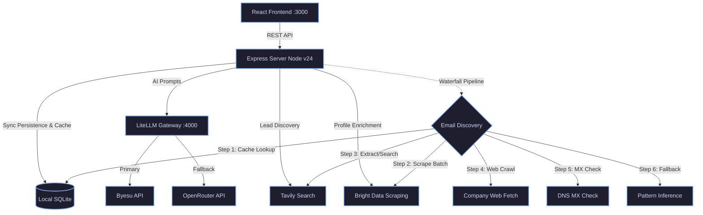

<div align="center">
  <h1>Apex CRM</h1>
  <p><strong>Next-Generation AI-Powered Sales, Lead Mining & Prospecting Platform</strong></p>

  <p>
    
    
    
    
    
    
  </p>
</div>

---

## Overview

**Apex CRM** is a cutting-edge, local-first Customer Relationship Management tool designed for modern sales teams. It seamlessly integrates AI-driven prospecting, intelligent lead enrichment, and automated outreach drafting into a single, lightning-fast workspace.

By combining the power of a **local LiteLLM gateway** with automatic **OpenRouter fallback routing**, **Bright Data** for deep profile enrichment, **Tavily** for real-time web scraping, and a **Local SQLite** backend, Apex CRM provides a highly resilient and cost-effective sales intelligence pipeline.

---

## Architecture & Tech Stack



### Core Technologies

- **Frontend**: React 19, TailwindCSS 4, Framer Motion (UI Animations), Lucide React (Icons)
- **Backend**: Express.js, TypeScript, Node.js v24
- **Database**: `node:sqlite` (Built-in Local-first DB with WAL mode, Enrichment Cache, and Email Discovery Caching)
- **AI Gateway**: LiteLLM (Local python-based routing proxy)
- **Integrations**: Byesu (Primary LLM), OpenRouter (Secondary Fallback LLM), Tavily (Search & Extract API), Bright Data (LinkedIn Profile & Search Scraper)

---

## Key Features

| Feature | Description |
| :--- | :--- |
| **Adaptive Lead Mining** | Auto-discover prospects via Tavily, score them, and verify them against target ICP criteria. |
| **Deep Profile Enrichment**| Automatically enrich leads using Bright Data's headless LinkedIn scraping API. |
| **Enrichment Cache** | Local SQLite caching layer that prevents duplicate API scraping & email discovery calls to save costs. |
| **Free-First Email Discovery** | A robust waterfall pipeline utilizing Bright Data batching, Tavily, local crawls, DNS/MX check, and email pattern inference to discover verified emails. |
| **LLM Gateway & Fallbacks**| Local LiteLLM proxy that routes to Byesu and automatically falls back to OpenRouter on failure. |
| **CRM Pipeline** | Visual Kanban board to drag-and-drop leads through your sales funnel. |
| **Outreach Studio** | AI-generated, hyper-personalized email drafts based on lead profiles and intent. |
| **Local-First Speed** | Zero-latency UI with background syncing to a durable, local SQLite database. |

---

## Getting Started

### Prerequisites

- **Node.js** (v24+ recommended for native SQLite support)
- **Python 3.12** (managed locally via `uv` under `.python/` for the LiteLLM proxy)
- API Keys for **Byesu**, **OpenRouter**, **Tavily**, and **Bright Data**

### Installation

1. **Clone the repository and install dependencies:**
   ```bash
   npm install
   ```

2. **Configure your Environment:**
   Copy the `.env.example` file to `.env` and fill in your credentials.

   ```env
   # Primary provider
   OPENAI_API_KEY="your_byesu_key"
   BYESU_API_KEY="your_byesu_key"
   OPENAI_BASE="https://api.byesu.com/v1"
   OPENAI_MODEL="gpt-5.5"

   # Direct fallbacks
   OPENROUTER_API_KEY="your_openrouter_key"
   OPENROUTER_MODEL="poolside/laguna-m.1:free"
   GROQ_API_KEY="your_groq_key"
   GROQ_MODEL="qwen/qwen3.6-27b"

   # External Integrations
   TAVILY_API_KEY="your_tavily_key"
   BRIGHTDATA_API_TOKEN="your_brightdata_token"

   # Email Discovery Configuration
   EMAIL_DISCOVERY_MODE="accepted_only" # "off" | "accepted_only" | "missing_only"
   EMAIL_DISCOVERY_MAX_PER_SEARCH="10"
   ```

3. **Start the Development Workspace:**
   ```bash
   npm run dev
   ```
   This starts the **Apex CRM Dev Server** on `http://localhost:3000`. LLM fallback is handled directly inside the app process.

---

## Privacy & Data

Apex CRM is designed to be **Local-First**. Your lead data is stored in a local SQLite file (`.apex-data/apex-crm.sqlite`) instead of the cloud, giving you complete control over your sales database. The database uses WAL (Write-Ahead Logging) mode for robust, transactional reliability.

---

<div align="center">
  <i>Built for the next generation of sales professionals.</i>
</div>
