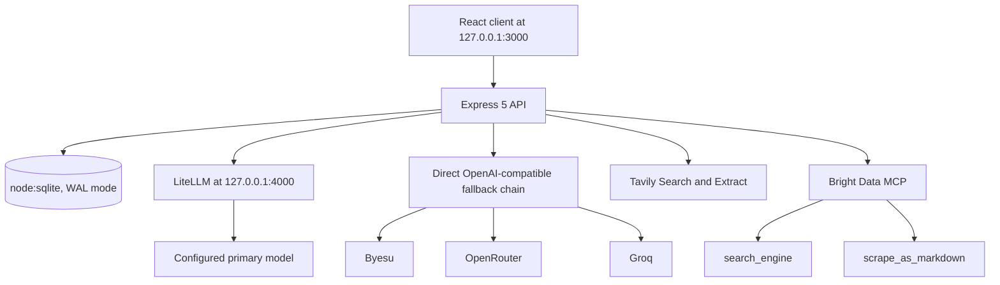

<div align="center">
  <h1>Apex CRM</h1>
  <p><strong>Local-first, evidence-grounded prospect scouting for LinkedIn-first workflows</strong></p>

  <p>
    
    
    
    
    
  </p>
</div>

---

## What Apex CRM is

Apex CRM is a single-user, local-first application for finding relevant prospects, collecting their LinkedIn profile links, reviewing the evidence behind each match, and keeping the resulting list organized.

Its primary workflow is intentionally practical:

1. Describe the people or companies you want to find.
2. Let the backend search public web results through Tavily and Bright Data.
3. Review evidence-grounded prospects and their LinkedIn URLs.
4. Send connection requests and messages manually on LinkedIn.

The application includes inventory, enrichment, pipeline, saved-search, activity, and outreach-draft surfaces, but it is not an automated LinkedIn outreach bot. It does not automate connection requests or LinkedIn messages, which avoids building the product around fragile browser automation and LinkedIn anti-bot behavior.

## Prospect discovery engine

```mermaid
flowchart LR
    Brief[Prospect brief] --> Contract[Prospect contract]
    Contract --> Plan[Search specification and query lanes]
    Plan --> Scheduler[Adaptive scheduler]
    Scheduler --> Tavily[Tavily Search and Extract]
    Scheduler --> Bright[Bright Data Search]
    Tavily --> Fusion[Normalize, fuse and deduplicate]
    Bright --> Fusion
    Fusion --> Evidence[Evidence extraction and validation]
    Evidence --> Judge[Strict fast-path or finalist judge]
    Judge --> Diversify[Rank and diversify by company]
    Diversify --> Inventory[Local prospect inventory]
    Inventory --> Manual[Manual LinkedIn connection and messaging]
```



### How qualification works

- A prospect brief is compiled into a versioned prospect contract containing explicit hard and soft requirements. A deterministic contract is always available if the LLM planner fails.
- Every generated and recovery query is checked against that contract so important role, location, company-type, and other supplied constraints are not silently dropped.
- Tavily and Bright Data retrieval tasks run through bounded provider queues. Results are normalized, fused across providers, deduplicated, and attributed to their originating query lane.
- Only exact structured-profile matches can take the deterministic qualification fast path. Ambiguous narrative evidence is reviewed by the finalist judge.
- The finalist judge must assess each contract requirement and can only cite evidence it was actually shown. Missing, malformed, or invented evidence becomes `unknown`, not a pass.
- Finalists are ranked and diversified by company. When strict qualification yields fewer prospects than requested, the response distinguishes safety-net `rescued` candidates from evidence-qualified candidates.
- Round diagnostics identify missing hard requirements and generate targeted recovery searches instead of blindly repeating the same queries.

### Adaptive retrieval

The engine stores query-family, lane, provider, finalist-outcome, latency, and provider-unit history in SQLite. After enough outcome-attributed runs exist, the adaptive scheduler favors productive retrieval arms while retaining exploration and a person-search lane. Cold-start behavior and explicit contract coverage remain deterministic.

## Architecture



### Core technologies

- Frontend: React 19, Vite 8, Tailwind CSS 4, Motion, Radix UI, and Lucide React.
- Backend: Node.js, TypeScript, Express 5, and `p-queue` provider scheduling.
- Persistence: built-in `node:sqlite` with WAL mode, transactional migrations, revision-aware writes, and local caches.
- LLM routing: local LiteLLM gateway by default, with direct OpenAI-compatible provider fallbacks and session circuit breaking.
- Retrieval: Tavily Search/Extract and Bright Data MCP search/page scraping.

## Current capabilities

| Capability | Current behavior |
| --- | --- |
| LinkedIn-first prospect scouting | Searches public, LinkedIn-oriented results and returns reviewable people with source URLs and evidence. |
| Prospect contracts | Preserves explicit targeting requirements across planning, retrieval, recovery, and final qualification. |
| Evidence-grounded finalist selection | Uses strict structured matches when safe and bounded LLM judging for ambiguous candidates. |
| Dual-provider discovery | Supports `hybrid`, `bd_primary`, and `tavily_primary` routing with independent concurrency controls. |
| Adaptive scheduling | Learns from finalist-attributed outcomes without pruning required contract coverage. |
| Selected profile enrichment | Uses Bright Data only for selected or post-filter records, backed by positive and negative caches. |
| Public email capture | Retains an email only when it is explicitly published in the same profile evidence; there is no separate automatic email-hunting stage in the main scout flow. |
| Inventory and review | Stores prospects locally with provenance, matched criteria, uncertainty, review status, next action, revisions, and activities. |
| Saved searches and previews | Persists reusable search specifications and previews retrieval tasks before a run. |
| Mining observability | Persists session state, trace events, provider summaries, phase timing, token usage, estimated cost, and query-performance outcomes. |
| Optional CRM/outreach surfaces | Supports stages, notes, outreach drafts, and AI-generated draft text, but these are supporting features rather than automated delivery. |

## Provider resilience and efficiency

### API key rotation

Every configured plural and singular key field is merged into one deduplicated provider pool:

- Tavily: `TAVILY_API_KEYS` plus `TAVILY_API_KEY`.
- Bright Data: `BRIGHTDATA_API_TOKENS` plus `BRIGHTDATA_API_TOKEN` and optional `API_TOKEN`.

Plural values may be JSON arrays or comma-separated lists. Sanitized pool state is available from `GET /api/key-rotation-status`; raw credentials are never returned.

Tavily rotates requests across healthy keys and fails over on authentication, quota, rate-limit, transient network, and server errors. Invalid request shapes stop immediately so a bad payload does not burn every key. Bright Data maintains one MCP client/token at a time and selects another healthy token when initialization or the active provider lifecycle requires reconnection. Key health is process-local and resets when the backend restarts.

### Bright Data behavior

- Free/Rapid mode uses only `search_engine` and `scrape_as_markdown`.
- Pro-only structured data, browser automation, and `scrape_batch` are not called unless the deployment explicitly opts into the appropriate plan.
- Search requests apply one bounded application retry by default for malformed/empty HTTP-success responses, timeouts, and transport failures that escape the MCP package's own retry loop.
- Authentication, quota, configuration, and validation errors are not blindly retried.
- Every physical provider attempt is reflected in usage and trace telemetry.

### Cost controls

Provider credit reservation is disabled by default. In this mode the application records provider units and relies on key rotation instead of prematurely refusing work. Set `PROVIDER_CREDIT_RESERVATION=true` only when you want the configured monthly budgets to become hard local caps.

Normal successful requests receive no retry delay. Concurrency and optional interval caps are configurable separately for Tavily search, Bright Data search, profile enrichment, extraction, and finalist judging.

## Getting started

### Prerequisites

- Node.js 24 or newer, required for the built-in SQLite API used by the backend.
- At least one OpenAI-compatible LLM credential.
- At least one retrieval provider: Tavily or Bright Data. Both are recommended for hybrid discovery.
- Python 3.12 and a repository-local `.venv-litellm` installation only when using `LLM_GATEWAY_MODE=litellm`.

### Install

```bash
npm install
```

Copy `.env.example` to `.env` and add credentials. On PowerShell:

```powershell
Copy-Item .env.example .env
```

A minimal direct-mode configuration looks like this:

```env
LLM_GATEWAY_MODE="direct"
OPENAI_API_KEY="your_primary_key"
OPENAI_BASE="https://your-openai-compatible-provider.example/v1"
OPENAI_MODEL="your_model"

TAVILY_API_KEYS='["tavily_key_1", "tavily_key_2"]'
TAVILY_API_KEY="tavily_key_3"

BRIGHTDATA_API_TOKENS='["brightdata_token_1", "brightdata_token_2"]'
BRIGHTDATA_API_TOKEN="brightdata_token_3"

DISCOVERY_PROVIDER_MODE="hybrid"
BRIGHTDATA_MCP_TRANSPORT="local"
```

The singular and plural fields are merged, so credentials in either location contribute quota to the same rotation pool.

### Run in development

```bash
npm run dev
```

`npm run dev` starts the app at `http://127.0.0.1:3000`. When `LLM_GATEWAY_MODE=litellm`, it also starts the repository-local LiteLLM proxy at `http://127.0.0.1:4000` using `litellm.config.yaml`.

To run only the Apex backend/frontend development server and manage the gateway separately:

```bash
npm run dev:server
```

### Production

```bash
npm run build
npm run start
```

The production server binds to `127.0.0.1`. API middleware validates Host and Origin headers to block DNS-rebinding and cross-origin access, and generated server bundles/source maps are not served as public static files.

## Important configuration

The complete configuration contract and safe defaults live in `.env.example`.

| Area | Variables |
| --- | --- |
| Provider routing | `DISCOVERY_PROVIDER_MODE`, `BRIGHTDATA_SEARCH_MODE`, `PROVIDER_CREDIT_RESERVATION` |
| Tavily | `TAVILY_API_KEYS`, `TAVILY_API_KEY`, search depth/results, concurrency, interval cap, and monthly budget variables |
| Bright Data | `BRIGHTDATA_API_TOKENS`, `BRIGHTDATA_API_TOKEN`, `BRIGHTDATA_PLAN`, MCP transport, search retry, concurrency, enrichment, cache, and budget variables |
| Adaptive retrieval | `LEAD_ADAPTIVE_SCHEDULER_ENABLED`, task count, minimum outcome runs, and exploration strength |
| Lead engine | Round limit, score threshold, rerank-pool sizing, extraction chunks/concurrency, and finalist-judge concurrency |
| LLM routing | `LLM_GATEWAY_MODE`, LiteLLM settings, primary provider settings, OpenRouter/Groq fallbacks, timeout, retry, token-budget, and circuit-breaker controls |
| Observability | `SEARCH_LOG_RETENTION_LIMIT` and optional per-million-token input/output cost rates |
| Persistence | `APEX_DB_PATH`, defaulting to `.apex-data/apex-crm.sqlite` |

## API overview

All routes are mounted below `/api`.

| Group | Routes |
| --- | --- |
| Health and providers | `GET /health`, `/llm-health`, `/key-rotation-status`, `/provider-capabilities` |
| Discovery | `POST /lead-search/preview`, `/find-leads`, `/scrape-url`, `/scrape-pasted` |
| Mining sessions | `GET /mining-sessions`, `/mining-sessions/:sessionId`, `/mining-sessions/:sessionId/trace`; `POST /mining-sessions/:sessionId/cancel` |
| Search telemetry | `GET /search-logs`, `/search-logs/:id/live` |
| Inventory | `GET/PUT/DELETE /leads`, `POST /leads/bulk`, `PATCH/DELETE /leads/:id`, activities, merge, and selected profile enrichment |
| Saved searches | `GET/POST /saved-searches`, `DELETE /saved-searches/:id` |
| Supporting features | Outreach-draft CRUD, `POST /generate-outbound`, and `POST /chat` |

## Persistence and migrations

The default database is `.apex-data/apex-crm.sqlite`. SQLite runs in WAL mode with foreign keys enabled and a busy timeout for safer local concurrency.

Schema version 9 includes:

- Prospect inventory, optimistic revisions, lead activities, merge history, and outreach drafts.
- Positive and negative enrichment caches, including explicitly published public email evidence.
- Durable mining sessions and retained search traces.
- Saved searches and normalized search specifications.
- Query performance by family, lane, and provider, including finalist outcomes, latency, and provider units.
- Monthly provider-usage accounting.
- Per-stage LLM token, latency, model, and provider logs.
- Versioned prospect-contract caching.

Migrations run transactionally at startup. Before changing an existing database, the backend creates a timestamped, WAL-safe backup under `.apex-data/backups/` using SQLite `VACUUM INTO` when available. Sessions left running after an interrupted process are marked `interrupted` on recovery.

## Verification

```bash
npm run lint
npm run test:lead-engine
npm run test:prospect-quality
npm run build
```

Useful focused suites include:

```bash
npm run test:key-rotation
npm run test:brightdata-upgrade
npm run test:telemetry
npm run test:persistence
```

## Privacy and limitations

- CRM records, caches, search logs, provider usage, and mining-session state are stored locally in SQLite.
- External providers receive only the search, evidence, URL, or prompt data needed for an operation you initiate.
- Company-page fetching rejects private/local destinations, requires HTTPS, and caps response size.
- Provider credentials remain in the local environment and are represented in telemetry only by sanitized labels and fingerprints.
- Prospect evidence comes from public-web provider results and may be incomplete or stale. Review evidence and LinkedIn profiles before acting.
- A requested count is a best-effort target, not permission to fabricate matches. Safety-net candidates are explicitly marked as rescued.
- LinkedIn connection requests and messages remain manual.

## Project layout

```text
src/                         React UI, state, shared types and workflow metadata
server/routes/api.ts         REST API and lead-discovery orchestration
server/services/             LLM, Tavily, Bright Data, key rotation and evidence services
server/leadSearch/           Contracts, scheduling, scoring, judging, queues and telemetry
server/db.ts                 SQLite schema, migrations, caches and persistence helpers
test/                        Focused backend, UI-contract and regression tests
scripts/dev.ts               Development process orchestration
litellm.config.yaml          Optional local LiteLLM gateway configuration
.env.example                 Complete runtime configuration reference
```

---

<div align="center">
  <i>Built for careful prospect research, not automated spam.</i>
</div>
