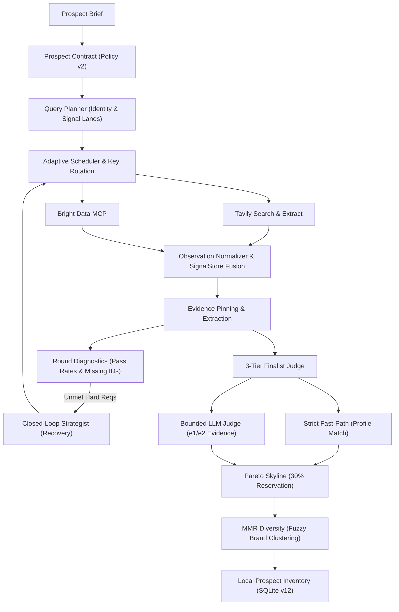
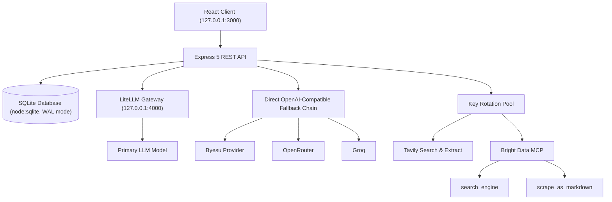

<div align="center">
  <h1>Apex CRM</h1>
  <p><strong>Local-first, evidence-grounded prospect scouting and CRM for LinkedIn-first workflows</strong></p>

  <p>
    
    
    
    
    
  </p>
</div>

---

## What Apex CRM is

Apex CRM is a single-user, local-first application for finding relevant prospects, collecting their LinkedIn profile links, reviewing verifiable evidence behind each match, and keeping the resulting list organized.

Its primary workflow is intentionally practical:

1. Describe the people or companies you want to find in natural language.
2. The engine compiles a versioned Prospect Contract and executes multi-modal retrieval tasks across public web sources using Tavily and Bright Data.
3. Observations from LinkedIn (identity) and the open web (intent/signals) are fused and verified.
4. Review evidence-grounded prospects, matched criteria, certainty scores, and LinkedIn URLs.
5. Send connection requests and messages manually on LinkedIn.

The application includes inventory management, stage tracking, profile enrichment, pipeline management, saved searches, activity history, and outreach draft generation. It is not an automated LinkedIn bot and avoids browser automation or fragile LinkedIn anti-bot hooks.

---

## Prospect Discovery Engine


```mermaid
flowchart TD
    Brief["Prospect Brief"] --> Contract["Prospect Contract (Policy v2)"]
    Contract --> Planner["Query Planner (Identity & Signal Lanes)"]
    Planner --> Scheduler["Adaptive Scheduler & Key Rotation"]
    Scheduler --> Tavily["Tavily Search & Extract"]
    Scheduler --> Bright["Bright Data MCP"]
    Tavily --> Fusion["Observation Normalizer & SignalStore Fusion"]
    Bright --> Fusion
    Fusion --> Evidence["Evidence Pinning & Extraction"]
    Evidence --> Diagnostics["Round Diagnostics (Pass Rates & Missing IDs)"]
    Diagnostics -->|Unmet Hard Reqs| Strategist["Closed-Loop Strategist (Recovery)"]
    Strategist --> Scheduler
    Evidence --> Judge["3-Tier Finalist Judge"]
    Judge --> FastPath["Strict Fast-Path (Profile Match)"]
    Judge --> LLMJudge["Bounded LLM Judge (e1/e2 Evidence)"]
    FastPath --> Pareto["Pareto Skyline (30% Reservation)"]
    LLMJudge --> Pareto
    Pareto --> MMR["MMR Diversity (Fuzzy Brand Clustering)"]
    MMR --> Inventory["Local Prospect Inventory (SQLite v12)"]
```

### Key Architectural Capabilities

#### 1. Multi-Modal Prospect Contracts (Policy v2)
- Compiles the user's natural language brief into explicit hard and soft criteria with semantic term expansion (`acceptableTerms`).
- Supports multi-modality requirement scopes:
  - `person_role` / `person_location` / `company_type`: Verified against `structured_profile` evidence.
  - `signal`: Verified against `open_web_signal` evidence (e.g. job postings, tech stacks, press releases, hiring surges).
  - `authority`: Verified against `domain_verification` and decision-maker titles.
- Deterministic fallback compiler ensures search continuity even when LLM planner APIs are unavailable.

#### 2. Dual-Lane Retrieval & SignalStore Fusion
- **Identity Lanes (`lane: "identity"`)**: Prioritize LinkedIn profile URLs and personal authority.
- **Signal Lanes (`lane: "signal"`)**: Target open web and company pages for external intent triggers (e.g., Lever, Greenhouse, tech stack announcements).
- **SignalStore**: Automatically normalizes company brand variations (`companiesMatch`), extracts company hints from hosted domains/paths, and attaches corroborating signals to prospect profiles.

#### 3. Evidence Budgeting & Pinned Signal Defense
- Evidence blocks for candidate evaluation are strictly bounded to prevent context window overflow.
- Open-web signal blocks (`[OPEN-WEB SIGNAL:]`) are pinned to a reserved evidence slot (`e2`) to ensure hiring and intent proof is never evicted by profile snippet length.

#### 4. 3-Tier Finalist Judge
- **Strict Fast-Path**: Candidates with exact, unambiguous structured profile matches bypass LLM evaluation with zero token cost.
- **Bounded LLM Judge**: Evaluates ambiguous candidates strictly against provided evidence snippets. Missing evidence is assigned `unknown`.
- **Modality-Aware Scoring**: Candidates passing all profile requirements but missing open-web signal confirmation receive `qualified_partial` (with a 15% discount), while failing a hard requirement results in an immediate hard fail.

#### 5. Closed-Loop Multi-Round Recovery
- `buildRoundDiagnostics` measures per-requirement pass rates across candidate batches in real time.
- Unmet hard requirements (pass rate < 25%) are identified and fed directly into `buildStrategistPrompt` as `missingRequirementIds`.
- The Strategist generates focused recovery queries to specifically address missing constraints rather than guessing from the raw brief.
- Session-aware recovery (`alreadyQualified`) stops query execution when target lead volume is fulfilled.

#### 6. Pareto Skyline Guarantee & MMR Diversity
- **Pareto Skyline**: Up to 30% of candidate slots are reserved for non-dominated Pareto front outliers (high authority, high intent, or strong evidence), preventing dilution by single-metric scoring.
- **Maximal Marginal Relevance (MMR)**: Uses tokenized fuzzy company brand matching (`companiesMatch`) to prevent over-indexing on company variations (e.g., "Acme Corp" vs "Acme LLC").

---

## System Architecture


```mermaid
graph TD
    UI["React Client (127.0.0.1:3000)"] --> API["Express 5 REST API"]
    API --> DB[("SQLite Database (node:sqlite, WAL mode)")]

    API --> Gateway["LiteLLM Gateway (127.0.0.1:4000)"]
    API --> Direct["Direct OpenAI-Compatible Fallback Chain"]
    Gateway --> Primary["Primary LLM Model"]
    Direct --> Byesu["Byesu Provider"]
    Direct --> OpenRouter["OpenRouter"]
    Direct --> Groq["Groq"]

    API --> KeyRotator["Key Rotation Pool"]
    KeyRotator --> Tavily["Tavily Search & Extract"]
    KeyRotator --> MCP["Bright Data MCP"]
    MCP --> BDSearch["search_engine"]
    MCP --> BDScrape["scrape_as_markdown"]
```

### Technology Stack

- **Frontend**: React 19, Vite 6, Tailwind CSS 4, Motion, Radix UI, Lucide React.
- **Backend**: Node.js 24+, TypeScript 5.9, Express 5, `p-queue` rate limiting.
- **Persistence**: Built-in `node:sqlite` in WAL mode with transactional schema migrations (version 12), optimistic revision locking, and automatic WAL-safe backups.
- **LLM Routing**: LiteLLM proxy gateway or direct OpenAI-compatible provider fallback chain (Byesu -> OpenRouter -> Groq) with session circuit breaker.
- **Retrieval**: Multi-key rotating Tavily Search/Extract and Bright Data MCP (`search_engine`, `scrape_as_markdown`).

---

## Provider Resilience & Efficiency

### API Key Rotation
Singular and plural environment variables are merged into deduplicated rotation pools:
- **Tavily**: `TAVILY_API_KEYS` + `TAVILY_API_KEY`.
- **Bright Data**: `BRIGHTDATA_API_TOKENS` + `BRIGHTDATA_API_TOKEN` + `API_TOKEN`.

The rotation manager automatically routes requests across active keys, applies exponential backoff on 429 rate limits, and quarantines exhausted keys. Key pool status is inspectable at `GET /api/key-rotation-status` (without exposing raw secret keys).

### Bright Data Scraper Integration
- Free/Rapid mode uses `search_engine` and `scrape_as_markdown`.
- Bounded retry wrappers prevent transient network failures or malformed empty responses from failing discovery rounds.
- Provider usage and unit accounting are tracked in SQLite per session.

---

## Getting Started

### Prerequisites
- Node.js 24 or newer (for native `node:sqlite`).
- At least one OpenAI-compatible LLM endpoint/key.
- At least one search provider: Tavily or Bright Data (both recommended for hybrid discovery).
- Python 3.12 (optional, only when using `LLM_GATEWAY_MODE="litellm"`).

### Installation

```bash
npm install
```

Copy the configuration template:

```bash
cp .env.example .env
```

### Environment Configuration

A minimal `.env` setup:

```env
LLM_GATEWAY_MODE="direct"
OPENAI_API_KEY="your_primary_key"
OPENAI_BASE="https://your-openai-compatible-provider.example/v1"
OPENAI_MODEL="your_model"

TAVILY_API_KEYS='["tavily_key_1", "tavily_key_2"]'
TAVILY_API_KEY="tavily_key_3"

BRIGHTDATA_API_TOKENS='["brightdata_token_1", "brightdata_token_2"]'
BRIGHTDATA_API_TOKEN="brightdata_token_3"

DISCOVERY_PROVIDER_MODE="hybrid"
BRIGHTDATA_MCP_TRANSPORT="local"
```

### Running Locally

```bash
# Start Vite frontend and Express backend concurrently
npm run dev

# Or start only the backend server
npm run dev:server
```

Open `http://127.0.0.1:3000` in your browser.

### Production Build

```bash
npm run build
npm run start
```

---

## API Reference

All API routes are mounted under `/api`:

| Group | Method & Route | Description |
| --- | --- | --- |
| **Health & Status** | `GET /health` | Application status and uptime |
| | `GET /llm-health` | LLM gateway and provider latency status |
| | `GET /key-rotation-status` | Sanitized provider key pool health |
| | `GET /provider-capabilities` | Supported scraper and search features |
| **Discovery** | `POST /lead-search/preview` | Preview compiled contract and query plan |
| | `POST /find-leads` | Execute full discovery session |
| | `POST /scrape-url` | Scrape public web page markdown |
| | `POST /scrape-pasted` | Parse raw pasted text into prospect leads |
| **Mining Sessions** | `GET /mining-sessions` | List historical mining sessions |
| | `GET /mining-sessions/:sessionId` | Get specific mining session details |
| | `GET /mining-sessions/:sessionId/trace` | Stream live real-time execution trace |
| | `POST /mining-sessions/:sessionId/cancel` | Cancel active mining run |
| **Search Logs** | `GET /search-logs` | Query performance and cost summaries |
| | `GET /search-logs/:id/live` | Live log stream for active search |
| **Prospects & CRM** | `GET /leads` | List stored prospects with filtering |
| | `POST /leads/bulk` | Bulk insert or update prospect records |
| | `PATCH /leads/:id` | Update lead stage, review status, or notes |
| | `DELETE /leads/:id` | Soft-delete or archive prospect |
| | `POST /leads/:id/enrich` | Enrich specific lead via Bright Data |
| **Saved Searches** | `GET /saved-searches` | List saved search specifications |
| | `POST /saved-searches` | Create or update saved search |
| | `DELETE /saved-searches/:id` | Delete saved search |
| **Outreach** | `POST /generate-outbound` | Generate contextual outreach message |
| | `POST /chat` | CRM conversational assistant |

---

## Database & Schema (v12)

The default database is `.apex-data/apex-crm.sqlite`. SQLite runs in WAL mode with foreign keys enabled and busy timeouts configured.

### Schema Capabilities:
- **`leads`**: Core prospect records, LinkedIn canonical identities, matched criteria, uncertainty scores, and revision locks.
- **`mining_sessions`**: Durable execution sessions, target progress, and phase summaries.
- **`mining_traces`**: Granular event streams for real-time observability.
- **`query_performance`**: Historical yield, latency, and provider unit accounting per query family and lane.
- **`prospect_contracts`**: Versioned requirement contracts and compilation metadata.
- **`intent_cache`**: Dynamic company intent signals and observation fingerprints.
- **`enrichment_cache`**: Positive and negative profile scraping caches.
- **`search_specs` & `saved_searches`**: Reusable prospecting configurations.
- **`lead_activities` & `outreach_drafts`**: Audit trails and draft messaging.

Automated backups are created under `.apex-data/backups/` before schema migrations run.

---

## Verification & Testing

Apex CRM maintains an extensive test suite:

```bash
# Typecheck
npm run lint

# Core Lead Engine Suite (132 tests)
npm run test:lead-engine

# Prospect Quality & Contract Suite (18 tests)
npm run test:prospect-quality

# Intent Signals & Dynamic Enrichment
npm run test:intent-engine

# Scout Pipeline & Provider Routing
npm run test:scout

# Key Rotation & Fallback Chains
npm run test:key-rotation

# LLM Gateway & Budget Limits
npm run test:llm

# Persistence & Revisions
npm run test:persistence
```

---

## Privacy & Operating Guidelines

- All CRM records, cached profiles, search traces, and telemetry are stored locally in SQLite.
- External providers receive only the query string and evidence required to fulfill the specific operation.
- Outbound URL scraping enforces HTTPS, validates destination hostnames, and rejects private/loopback IP ranges.
- API keys and tokens remain strictly local and are never logged or returned through the API.
- Prospect information is derived from public web data. Always verify profiles before manual outreach.
- LinkedIn outreach remains completely manual to protect your account and maintain message authenticity.

---

## Project Structure

```text
src/
  components/                React UI components, modals, tables, badges
  hooks/                     UI hooks and real-time trace subscriptions
  types.ts                   Shared TypeScript types and contract definitions
  utils/                     Deduplication, normalization, and UI formatting
server/
  routes/
    api.ts                   REST API endpoints and discovery orchestration
  services/
    llm.ts                   LLM gateway, fallbacks, and JSON schemas
    tavily.ts                Tavily search, extraction, and key rotation
    brightData.ts            Bright Data MCP client, search, and scraper
    keyRotator.ts            Provider key pool and rate-limit manager
    evidenceService.ts       Markdown extraction and email discovery
  leadSearch/
    prospectContract.ts      Contract schema and semantic compiler
    finalistJudge.ts         3-Tier Judge and strict candidate evaluation
    roundDiagnostics.ts      Pass-rate diagnostics and recovery detection
    searchSpec.ts            Query planner and strategist prompts
    intentSignals.ts         Cross-vertical intent signals compiler
    observations.ts          Observation normalization and company extraction
    signalStore.ts           Brand matching and signal fusion
    scoutScoring.ts          Scout candidate scoring and Pareto reservation
    scoring.ts               Final composite scoring and MMR diversity
    verification.ts          Decision-maker verification and title checks
    targetFulfillment.ts     Multi-round fulfillment engine
    telemetry.ts             Cost, token, and execution logging
  db.ts                      SQLite v12 schema, migrations, and CRUD helpers
test/                        Automated unit, integration, and replay test suites
scripts/                     Dev orchestrator and server runners
litellm.config.yaml          LiteLLM proxy configuration
.env.example                 Configuration variables and default settings
```

---

<div align="center">
  <i>Built for careful, evidence-grounded prospect research.</i>
</div>
