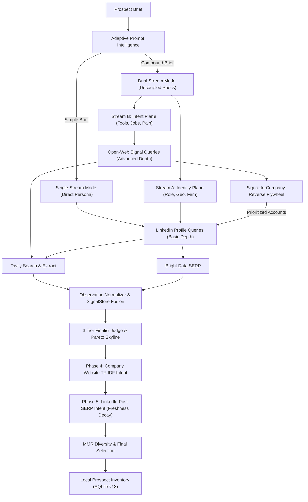
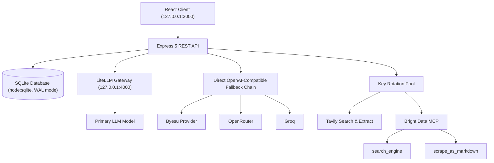

<div align="center">
  <h1>Apex CRM</h1>
  <p><strong>Local-first, evidence-grounded prospect scouting and CRM for LinkedIn-first workflows</strong></p>

  <p>
    
    
    
    
    
    
  </p>
</div>

---

## What Apex CRM is

Apex CRM is a single-user, local-first application for finding relevant prospects, collecting their LinkedIn profile links, reviewing verifiable evidence behind each match, and keeping the resulting list organized.

Its primary workflow is intentionally practical:

1. Describe the people or companies you want to find in natural language.
2. The engine uses **Adaptive Prompt Intelligence** to classify your brief:
   - Simple persona briefs run direct high-recall discovery with zero LLM overhead.
   - Long-shot intent briefs decouple into **Stream A (Identity)** for 100% SERP recall and **Stream B (Intent Triggers)** for multi-channel open-web research.
3. The engine executes multi-modal retrieval tasks across public web sources using Tavily and Bright Data.
4. Active hiring/tooling triggers on the open web feed a **Signal-to-Company Reverse Flywheel**, immediately retrieving executives at companies with verified intent.
5. High-fidelity enrichment analyzes company websites (**Phase 4 TF-IDF**) and public prospect activity (**Phase 5 LinkedIn Post SERP Intent with Temporal Freshness Decay**).
6. Review evidence-grounded prospects, matched criteria, "Why Now" flame/radio badges, certainty intervals, and LinkedIn URLs.
7. Send connection requests and messages manually on LinkedIn.

The application includes inventory management, stage tracking, profile enrichment, pipeline management, saved searches, activity history, and outreach draft generation. It is not an automated LinkedIn bot and avoids browser automation or fragile LinkedIn anti-bot hooks.

---

## Prospect Discovery Engine


```mermaid
flowchart TD
    Brief["Prospect Brief"] --> Classifier["Adaptive Prompt Intelligence"]
    Classifier -->|Simple Brief| StreamIdentity["Single-Stream Mode (Direct Persona)"]
    Classifier -->|Compound Brief| StreamDual["Dual-Stream Mode (Decoupled Specs)"]
    StreamDual --> StreamA["Stream A: Identity Plane (Role, Geo, Firm)"]
    StreamDual --> StreamB["Stream B: Intent Plane (Tools, Jobs, Pain)"]
    StreamIdentity --> PersonQueries["LinkedIn Profile Queries (Basic Depth)"]
    StreamA --> PersonQueries
    StreamB --> SignalQueries["Open-Web Signal Queries (Advanced Depth)"]
    SignalQueries --> Tavily["Tavily Search & Extract"]
    PersonQueries --> Tavily
    PersonQueries --> Bright["Bright Data SERP"]
    SignalQueries --> Flywheel["Signal-to-Company Reverse Flywheel"]
    Flywheel -->|Prioritized Accounts| PersonQueries
    Tavily --> Fusion["Observation Normalizer & SignalStore Fusion"]
    Bright --> Fusion
    Fusion --> Judge["3-Tier Finalist Judge & Pareto Skyline"]
    Judge --> Phase4["Phase 4: Company Website TF-IDF Intent"]
    Phase4 --> Phase5["Phase 5: LinkedIn Post SERP Intent (Freshness Decay)"]
    Phase5 --> MMR["MMR Diversity & Final Selection"]
    MMR --> Inventory["Local Prospect Inventory (SQLite v13)"]
```

### Key Architectural Capabilities

#### 1. Adaptive Prompt Intelligence & Decoupled Decomposition
- **Mode 1: `single_stream_identity`**: Automatically fast-tracks simple persona briefs (e.g., *"Immigration lawyers in London"*), skipping dynamic intent compilation to save ~1.5s latency and 1 LLM call per session.
- **Mode 2: `dual_stream_intent`**: Decouples compound briefs into **Stream A (Identity Spec)** and **Stream B (Intent Spec)**.
- **Zero-Yield Search Fix**: Enforces that `person` lane profile discovery queries (`site:linkedin.com/in/`) contain **only** identity terms (Role + Location + Company Type), permanently preventing 0-yield SERP results caused by cramming niche intent keywords into profile searches.

#### 2. Multi-Source Intent Research (Phases 4 & 5)
- **Phase 4 (Company Website TF-IDF)**: Scrapes company websites against categorized intent dictionaries (`tooling` 1.5x, `hiring` 1.4x, `pain` 1.2x) with session-scoped IDF corpus weighting.
- **Phase 5 (LinkedIn Post SERP Intent)**: Queries Google for indexed prospect post snippets (`site:linkedin.com/posts <handle>`), classifies intent categories (`hiring`, `evaluating_tools`, `pain_signal`, `growth_signal`), and renders "Why Now" (Active Intent / Activity) indicators and detail cards.
- **Temporal Freshness Decay**: Parses SERP snippet recency markers (`"2 days ago"`, `"3 weeks ago"`, `"4 months ago"`) and applies exponential half-life decay (e^(-0.02 * days)) so newly published intent triggers receive full boost.

#### 3. Signal-to-Company Reverse Flywheel
- When Stream B searches open-web job boards and careers pages, discovered companies with active buying triggers are registered in `SignalStore`.
- The strategist automatically synthesizes prioritized profile queries targeting decision-makers at those specific accounts:
  `site:linkedin.com/in/ ("Founder" OR "CEO") "DiscoveredCompany"`

#### 4. Dynamic Search Depth Escalation (Cost & Recall Optimized)
- Persona discovery queries are locked to Tavily `searchDepth: 'basic'` (1 credit per query, high recall).
- Top priority open-web signal queries escalate to `searchDepth: 'advanced'` to extract rich job descriptions and tech stack snippets, reducing session credit consumption by ~60%.

#### 5. 3-Tier Finalist Judge & Pareto Skyline
- **Strict Fast-Path**: Direct, unambiguous profile matches auto-qualify with zero LLM overhead.
- **Bounded Semantic Judge**: Evaluates ambiguous candidates strictly against cited evidence snippets. Candidates with verified profiles but unconfirmed open-web signals receive `qualified_partial` (15% discount), while failing a hard requirement results in an immediate hard fail.
- **Pareto Skyline Guarantee**: Up to 30% of candidate slots are reserved for non-dominated Pareto front outliers (high authority + high verified intent).
- **Maximal Marginal Relevance (MMR)**: Uses tokenized fuzzy company brand matching (`companiesMatch`) to prevent over-indexing on company variations.

---

## System Architecture


```mermaid
graph TD
    UI["React Client (127.0.0.1:3000)"] --> API["Express 5 REST API"]
    API --> DB[("SQLite Database (node:sqlite, WAL mode)")]

    API --> Gateway["LiteLLM Gateway (127.0.0.1:4000)"]
    API --> Direct["Direct OpenAI-Compatible Fallback Chain"]
    Gateway --> Primary["Primary LLM Model"]
    Direct --> Byesu["Byesu Provider"]
    Direct --> OpenRouter["OpenRouter"]
    Direct --> Groq["Groq"]

    API --> KeyRotator["Key Rotation Pool"]
    KeyRotator --> Tavily["Tavily Search & Extract"]
    KeyRotator --> MCP["Bright Data MCP"]
    MCP --> BDSearch["search_engine"]
    MCP --> BDScrape["scrape_as_markdown"]
```

### Technology Stack

- **Frontend**: React 19, Vite 6, Tailwind CSS 4, Motion, Radix UI, Lucide React.
- **Backend**: Node.js 24+, TypeScript 5.9, Express 5, `p-queue` rate limiting.
- **Persistence**: Built-in `node:sqlite` in WAL mode with transactional schema migrations (version 12), optimistic revision locking, and automatic WAL-safe backups.
- **LLM Routing**: LiteLLM proxy gateway or direct OpenAI-compatible provider fallback chain (Byesu -> OpenRouter -> Groq) with session circuit breaker.
- **Retrieval**: Multi-key rotating Tavily Search/Extract and Bright Data MCP (`search_engine`, `scrape_as_markdown`).

---

## Provider Resilience & Efficiency

### API Key Rotation
Singular and plural environment variables are merged into deduplicated rotation pools:
- **Tavily**: `TAVILY_API_KEYS` + `TAVILY_API_KEY`.
- **Bright Data**: `BRIGHTDATA_API_TOKENS` + `BRIGHTDATA_API_TOKEN` + `API_TOKEN`.

The rotation manager automatically routes requests across active keys, applies exponential backoff on 429 rate limits, and quarantines exhausted keys. Key pool status is inspectable at `GET /api/key-rotation-status` (without exposing raw secret keys).

### Bright Data Scraper Integration
- Free/Rapid mode uses `search_engine` and `scrape_as_markdown`.
- Bounded retry wrappers prevent transient network failures or malformed empty responses from failing discovery rounds.
- Provider usage and unit accounting are tracked in SQLite per session.

---

## Getting Started

### Prerequisites
- Node.js 24 or newer (for native `node:sqlite`).
- At least one OpenAI-compatible LLM endpoint/key.
- At least one search provider: Tavily or Bright Data (both recommended for hybrid discovery).
- Python 3.12 (optional, only when using `LLM_GATEWAY_MODE="litellm"`).

### Installation

```bash
npm install
```

Copy the configuration template:

```bash
cp .env.example .env
```

### Environment Configuration

A minimal `.env` setup:

```env
LLM_GATEWAY_MODE="direct"
OPENAI_API_KEY="your_primary_key"
OPENAI_BASE="https://your-openai-compatible-provider.example/v1"
OPENAI_MODEL="your_model"

TAVILY_API_KEYS='["tavily_key_1", "tavily_key_2"]'
TAVILY_API_KEY="tavily_key_3"

BRIGHTDATA_API_TOKENS='["brightdata_token_1", "brightdata_token_2"]'
BRIGHTDATA_API_TOKEN="brightdata_token_3"

DISCOVERY_PROVIDER_MODE="hybrid"
BRIGHTDATA_MCP_TRANSPORT="local"
```

### Running Locally

```bash
# Start Vite frontend and Express backend concurrently
npm run dev

# Or start only the backend server
npm run dev:server
```

Open `http://127.0.0.1:3000` in your browser.

### Production Build

```bash
npm run build
npm run start
```

---

## API Reference

All API routes are mounted under `/api`:

| Group | Method & Route | Description |
| --- | --- | --- |
| **Health & Status** | `GET /health` | Application status and uptime |
| | `GET /llm-health` | LLM gateway and provider latency status |
| | `GET /key-rotation-status` | Sanitized provider key pool health |
| | `GET /provider-capabilities` | Supported scraper and search features |
| **Discovery** | `POST /lead-search/preview` | Preview compiled contract and query plan |
| | `POST /find-leads` | Execute full discovery session |
| | `POST /scrape-url` | Scrape public web page markdown |
| | `POST /scrape-pasted` | Parse raw pasted text into prospect leads |
| **Mining Sessions** | `GET /mining-sessions` | List historical mining sessions |
| | `GET /mining-sessions/:sessionId` | Get specific mining session details |
| | `GET /mining-sessions/:sessionId/trace` | Stream live real-time execution trace |
| | `POST /mining-sessions/:sessionId/cancel` | Cancel active mining run |
| **Search Logs** | `GET /search-logs` | Query performance and cost summaries |
| | `GET /search-logs/:id/live` | Live log stream for active search |
| **Prospects & CRM** | `GET /leads` | List stored prospects with filtering |
| | `POST /leads/bulk` | Bulk insert or update prospect records |
| | `PATCH /leads/:id` | Update lead stage, review status, or notes |
| | `DELETE /leads/:id` | Soft-delete or archive prospect |
| | `POST /leads/:id/enrich` | Enrich specific lead via Bright Data |
| **Saved Searches** | `GET /saved-searches` | List saved search specifications |
| | `POST /saved-searches` | Create or update saved search |
| | `DELETE /saved-searches/:id` | Delete saved search |
| **Outreach** | `POST /generate-outbound` | Generate contextual outreach message |
| | `POST /chat` | CRM conversational assistant |

---

## Database & Schema (v13)

The default database is `.apex-data/apex-crm.sqlite`. SQLite runs in WAL mode with foreign keys enabled and busy timeouts configured.

### Schema Capabilities:
- **`leads`**: Core prospect records, LinkedIn canonical identities, matched criteria, postIntentEvidence, uncertainty scores, and revision locks.
- **`mining_sessions`**: Durable execution sessions, target progress, and phase summaries.
- **`mining_traces`**: Granular event streams for real-time observability.
- **`query_performance`**: Historical yield, latency, and provider unit accounting per query family and lane.
- **`prospect_contracts`**: Versioned requirement contracts, decomposition modes, and compilation metadata.
- **`intent_cache`**: Dynamic company intent signals and observation fingerprints.
- **`enrichment_cache`**: Positive and negative profile scraping caches.
- **`search_specs` & `saved_searches`**: Reusable prospecting configurations.
- **`lead_activities` & `outreach_drafts`**: Audit trails and draft messaging.

Automated backups are created under `.apex-data/backups/` before schema migrations run.

---

## Verification & Testing

Apex CRM maintains an extensive test suite:

```bash
# Typecheck (0 errors)
npm run lint

# Full Lead Engine Suite (150 tests)
npm run test:lead-engine

# Adaptive Decomposition & Multi-Source Intent Suite (24 tests)
npm run test:intent-engine

# Prospect Quality & Contract Suite (19 tests)
npm run test:prospect-quality

# UI Contracts & Dashboard Nav (6 tests)
npm run test:ui

# ASCII & UTF-8 Encoding Hygiene (1 test)
npm run test:glyphs

# Scout Pipeline & Provider Routing
npm run test:scout

# Key Rotation & Fallback Chains
npm run test:key-rotation

# LLM Gateway & Budget Limits
npm run test:llm

# Persistence, Identity Deduplication & Revisions
npm run test:dedupe
```

---

## Privacy & Operating Guidelines

- All CRM records, cached profiles, search traces, and telemetry are stored locally in SQLite.
- External providers receive only the query string and evidence required to fulfill the specific operation.
- Outbound URL scraping enforces HTTPS, validates destination hostnames, and rejects private/loopback IP ranges.
- API keys and tokens remain strictly local and are never logged or returned through the API.
- Prospect information is derived from public web data. Always verify profiles before manual outreach.
- LinkedIn outreach remains completely manual to protect your account and maintain message authenticity.

---

## Project Structure

```text
src/
  components/                React UI components, modals, tables, badges
  hooks/                     UI hooks and real-time trace subscriptions
  types.ts                   Shared TypeScript types and contract definitions
  utils/                     Deduplication, normalization, and UI formatting
server/
  routes/
    api.ts                   REST API endpoints and HTTP adapters
  services/
    llm.ts                   LLM gateway, fallbacks, and JSON schemas
    tavily.ts                Tavily search, extraction, and key rotation
    brightData.ts            Bright Data MCP client, search, and scraper
    keyRotator.ts            Provider key pool and rate-limit manager
    evidenceService.ts       Markdown extraction and email discovery
  leadSearch/
    discoveryEngine.ts       Deep Discovery Session Engine & reverse flywheel
    prospectContract.ts      Contract schema, prompt intelligence & decomposition
    intentSignals.ts         Dynamic signal compiler, categories & freshness decay
    companyIntent.ts         Phase 4 company website TF-IDF intent scoring
    linkedinPostIntent.ts    Phase 5 LinkedIn post SERP intent research
    finalistJudge.ts         3-Tier Judge and strict candidate evaluation
    roundDiagnostics.ts      Pass-rate diagnostics and recovery detection
    searchSpec.ts            Query planner, dynamic depth & strategist prompts
    observations.ts          Observation normalization and company extraction
    signalStore.ts           Brand matching and signal fusion
    scoutScoring.ts          Scout candidate scoring and Pareto reservation
    scoring.ts               Composite scoring, freshness decay & MMR diversity
    verification.ts          Decision-maker verification and title checks
    targetFulfillment.ts     Forwarding facade for discovery engine
    telemetry.ts             Cost, token, and execution logging
  db.ts                      SQLite v13 schema, migrations, and CRUD helpers
test/                        Automated unit, integration, and replay test suites
scripts/                     Dev orchestrator and server runners
litellm.config.yaml          LiteLLM proxy configuration
.env.example                 Configuration variables and default settings
```

---

<div align="center">
  <i>Built for careful, evidence-grounded prospect research.</i>
</div>
