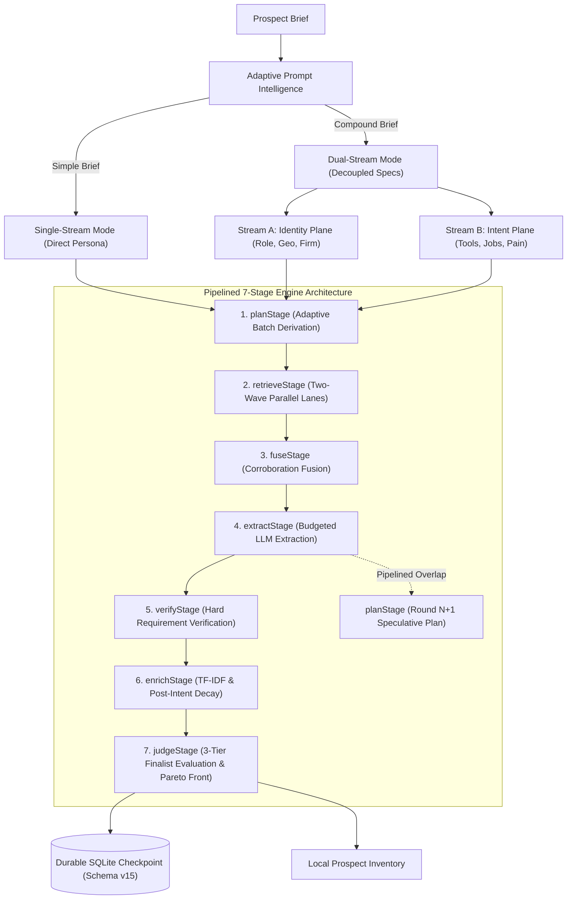
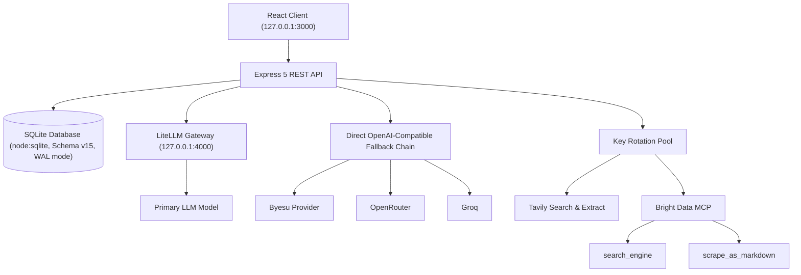

<div align="center">
  <h1>Apex CRM</h1>
  <p><strong>Local-first, evidence-grounded prospect scouting and CRM for LinkedIn-first workflows</strong></p>

  <p>
    
    
    
    
    
    
  </p>
</div>

---

## What Apex CRM is

Apex CRM is a single-user, local-first application for finding relevant prospects, collecting their LinkedIn profile links, reviewing verifiable evidence behind each match, and keeping the resulting list organized.

Its primary workflow is intentionally practical:

1. **Describe your search brief** in natural language.
2. **Adaptive Prompt Intelligence** classifies your brief:
   - Simple persona briefs run direct high-recall discovery with zero LLM overhead.
   - Long-shot intent briefs decouple into **Stream A (Identity)** for 100% SERP recall and **Stream B (Intent Triggers)** for multi-channel open-web research.
3. **Stage-Pipelined High-Concurrency Engine**:
   - Executes **Two-Wave Parallel Retrieval** across Tavily and Bright Data simultaneously.
   - Overlaps background query planning for Round $N+1$ while Round $N$ profiles are being extracted and verified.
4. **Signal-to-Company Reverse Flywheel**: Discovered hiring/tooling triggers on the open web immediately feed prioritized executive search queries.
5. **Multi-Source Intent Enrichment**: Analyzes company websites (**TF-IDF Intent**) and public prospect activity (**LinkedIn Post SERP Intent with Temporal Freshness Decay**).
6. **Durable Checkpoints & Resiliency**: Saves stage-boundary SQLite snapshots (`checkpoint_json`), allowing any interrupted search to be resumed with 1 click.
7. **Revision Conflict Resolution**: Interactive side-by-side conflict dialog protects lead edits from background task collisions.
8. **Review & Manual Outreach**: Review evidence-grounded matches, certainty scores, and contact details, then reach out manually on LinkedIn.

---

## Prospect Discovery Engine


```mermaid
flowchart TD
    Brief["Prospect Brief"] --> Classifier["Adaptive Prompt Intelligence"]
    Classifier -->|Simple Brief| StreamIdentity["Single-Stream Mode (Direct Persona)"]
    Classifier -->|Compound Brief| StreamDual["Dual-Stream Mode (Decoupled Specs)"]
    StreamDual --> StreamA["Stream A: Identity Plane (Role, Geo, Firm)"]
    StreamDual --> StreamB["Stream B: Intent Plane (Tools, Jobs, Pain)"]

    subgraph Stages ["Pipelined 7-Stage Engine Architecture"]
        Plan["1. planStage (Adaptive Batch Derivation)"]
        Retrieve["2. retrieveStage (Two-Wave Parallel Lanes)"]
        Fuse["3. fuseStage (Corroboration Fusion)"]
        Extract["4. extractStage (Budgeted LLM Extraction)"]
        Verify["5. verifyStage (Hard Requirement Verification)"]
        Enrich["6. enrichStage (TF-IDF & Post-Intent Decay)"]
        Judge["7. judgeStage (3-Tier Finalist Evaluation & Pareto Front)"]

        Plan --> Retrieve --> Fuse --> Extract --> Verify --> Enrich --> Judge
        Extract -.->|Pipelined Overlap| PlanNext["planStage (Round N+1 Speculative Plan)"]
    end

    StreamIdentity --> Plan
    StreamA --> Plan
    StreamB --> Plan

    Judge --> Checkpoint[("Durable SQLite Checkpoint (Schema v15)")]
    Judge --> Inventory["Local Prospect Inventory"]
```

### Key Architectural Capabilities

#### 1. Two-Wave Concurrent Parallel Retrieval Lanes

- **Wave 1 (Parallel Dispatch)**: Executes all unconditional Tavily and Bright Data queries concurrently via `Promise.all([executeTavilyLane(), executeBrightDataLane()])`.
- **Wave 2 (Conditional Supplemental)**: Settle Wave 1, evaluates Tavily yield, and triggers supplemental Bright Data fallback searches only when Tavily yield is low (`< 5`), preserving 100% of hybrid-mode credit policies.
- **Safety & Error Isolation**: Shared abort signals, race-free in-task credit reservations, and per-task error containment.

#### 2. Speculative Stage Overlap ($\text{Plan}_{N+1}$ over $\text{Extract}_N$)

- While Round $N$ is executing LLM extraction chunking, profile verification, and intent enrichment, the LLM strategist pre-computes queries for Round $N+1$ in the background.
- `planStage` remains pure: queries and stats are committed to session state only at boundary $N+1$, ensuring early session stops never pollute state.

#### 3. Durable Checkpoints & Session Resumption (ADR-0002)

- **Stage Boundaries**: Persists a compact Tier-A snapshot (`MiningSessionCheckpoint`) to SQLite `checkpoint_json` after each round's enrichment stage and before judging.
- **Boot Sweep**: Automatically reconciles orphaned sessions on server restart into `resumable` status.
- **One-Click Recovery UI**: `ResumableSessionsBanner` in the UI alerts users of interrupted searches and resumes them from checkpoint with zero duplicate queries.
- **Dual-Mode HTTP**: Supports synchronous HTTP 200 execution or immediate HTTP 202 Accepted (`?mode=job` / `Prefer: respond-async`) with SSE stream URLs.

#### 4. Interactive Lead Revision Conflict Resolution (B2 Dialog)

- **Revision Locking**: Optimistic concurrency on `leads.revision`.
- **Side-by-Side Diff Modal**: Caught `LeadPatchConflictError` (HTTP 409) prompts the user with an interactive diff comparing local edits vs. server updates.
- **Three Resolution Pathways**:
  - _Overwrite With My Changes_: Applies local edits with the current server revision.
  - _Accept Server Version_: Discards local dirty state and syncs server canonical.
  - _Smart Merge_: Field-level union of changes and tags.

#### 5. High-Frequency Streaming Trace Store

- Built on React 18/19's `useSyncExternalStore` (`miningTraceStore`).
- Telemetry events and terminal logs stream into an isolated `<TraceTerminal>` outside React's render tree, eliminating layout shifts and typing lag during fast search rounds.

#### 6. Multi-Source Intent Research & Freshness Decay

- **Phase 4 (Company Website TF-IDF)**: Scrapes company websites against categorized intent dictionaries with session-scoped IDF corpus weighting.
- **Phase 5 (LinkedIn Post SERP Intent)**: Queries Google for indexed prospect post snippets (`site:linkedin.com/posts <handle>`), classifies intent categories (`hiring`, `evaluating_tools`, `pain_signal`, `growth_signal`), and renders "Why Now" badges.
- **Temporal Freshness Decay**: Parses SERP snippet recency markers (`"2 days ago"`, `"3 weeks ago"`) and applies exponential half-life decay ($e^{-0.02 \times \text{days}}$) so newly published intent triggers receive full boost.

#### 7. Domain-Clustered Multi-Armed Bandit & Dynamic Search Strategy (ADR-0003)

- **Domain Clustering**: Partitions cross-session MAB query performance by domain cluster (`b2b_agency`, `b2b_saas`, `executive_coaching`, `local_services`, `healthcare_life_sciences`) so agency learning does not pollute SaaS searches.
- **Exponential Moving Average Decay ($\lambda = 0.95$)**: Automatically downweights stale historical query metrics on every conflict update, allowing newly adapted strategies to emerge.
- **Dynamic Semantic Query Fallback**: Synthesizes non-colliding fallback queries using domain synonyms, tooling keywords, and pain signals directly from the compiled contract.
- **Intent-Density Pre-Ranking**: Sorts incoming search hits by contract requirement term density and executive role markers rather than raw character length.

#### 8. Entity Intelligence & High-Fidelity Site Probing (ADR-0003)

- **Career Trajectory DCR Fix & Modern Leadership**: Fully models Partners, Fractional CXOs, Practice Leads, RevOps/GTM Heads, and Principal Consultants with exponential role recency decay.
- **Commercial Signal Extraction**: Multi-tier site probe scans root domains and subpaths (`/pricing`, `/case-studies`, `/careers`, `/integrations`) to extract pricing models, customer proof, tech stacks, and active hiring roles.
- **Multi-Evidence Fallback Grounding**: The Finalist Judge scans all candidate evidence passages before flagging ungrounded verdicts, eliminating false-positive fabrication rejections.
- **Global Corporate Form Normalization**: Strips international corporate suffixes (`S.R.L.`, `S.A.S.`, `S.L.`, `AG`, `Pte Ltd`, `Sdn Bhd`, `Sp. z o.o.`, `ApS`, `Pty Ltd`) and regional branch designations (`EMEA`, `APAC`, `Global`, `Holdings`).

#### 9. Lean Adaptive Collection & Targeted Post-Selection Enrichment (ADR-0004)

- **Proportional Collection Capacity**: Calibrates candidate pool targets with a tight 1.15x–1.25x cushion (e.g. 25 candidates for a 20-lead target instead of 80–120).
- **Decoupled Early Exit**: Automatically terminates discovery rounds when verified candidate volume satisfies target limits, eliminating false-recovery round loops caused by keyword heuristics.
- **Targeted Post-Selection Enrichment**: Defers heavy company site probing (Phase 4) and LinkedIn post SERP intent (Phase 5) until after Finalist Judging and Pareto diversification, eliminating 70%+ of wasted network and LLM token overhead.
- **Capped Judge Batches**: Prioritizes top pre-ranked candidates for LLM evaluation, bounding judge batches to $1.35\times$ target limit.

---

## System Architecture


```mermaid
graph TD
    UI["React Client (127.0.0.1:3000)"] --> API["Express 5 REST API"]
    API --> DB[("SQLite Database (node:sqlite, Schema v15, WAL mode)")]

    API --> Gateway["LiteLLM Gateway (127.0.0.1:4000)"]
    API --> Direct["Direct OpenAI-Compatible Fallback Chain"]
    Gateway --> Primary["Primary LLM Model"]
    Direct --> Byesu["Byesu Provider"]
    Direct --> OpenRouter["OpenRouter"]
    Direct --> Groq["Groq"]

    API --> KeyRotator["Key Rotation Pool"]
    KeyRotator --> Tavily["Tavily Search & Extract"]
    KeyRotator --> MCP["Bright Data MCP"]
    MCP --> BDSearch["search_engine"]
    MCP --> BDScrape["scrape_as_markdown"]
```

### Technology Stack

- **Frontend**: React 19, Vite 6, Tailwind CSS 4, Motion, Radix UI, Lucide React, `useSyncExternalStore`.
- **Backend**: Node.js 24+, TypeScript 5.9, Express 5, `p-queue` rate limiting.
- **Persistence**: Built-in `node:sqlite` in WAL mode with transactional schema migrations (version 14), optimistic revision locking, durable checkpoints, and automatic WAL-safe backups.
- **LLM Routing**: LiteLLM proxy gateway or direct OpenAI-compatible provider fallback chain (Byesu -> OpenRouter -> Groq) with session circuit breaker.
- **Retrieval**: Multi-key rotating Tavily Search/Extract and Bright Data MCP (`search_engine`, `scrape_as_markdown`).

---

## Getting Started

### Prerequisites

- Node.js 24 or newer (for native `node:sqlite`).
- At least one OpenAI-compatible LLM endpoint/key.
- At least one search provider: Tavily or Bright Data (both recommended for hybrid discovery).
- Python 3.12 (optional, only when using `LLM_GATEWAY_MODE="litellm"`).

### Installation

```bash
npm install
```

Copy the configuration template:

```bash
cp .env.example .env
```

### Environment Configuration

A minimal `.env` setup:

```env
LLM_GATEWAY_MODE="direct"
OPENAI_API_KEY="your_primary_key"
OPENAI_BASE="https://your-openai-compatible-provider.example/v1"
OPENAI_MODEL="your_model"

TAVILY_API_KEYS='["tavily_key_1", "tavily_key_2"]'
TAVILY_API_KEY="tavily_key_3"

BRIGHTDATA_API_TOKENS='["brightdata_token_1", "brightdata_token_2"]'
BRIGHTDATA_API_TOKEN="brightdata_token_3"

DISCOVERY_PROVIDER_MODE="hybrid"
BRIGHTDATA_MCP_TRANSPORT="local"
```

### Running Locally

```bash
# Start Vite frontend and Express backend concurrently
npm run dev

# Or start only the backend server
npm run dev:server
```

Open `http://127.0.0.1:3000` in your browser.

### Production Build

```bash
npm run build
npm run start
```

---

## API Reference

All API routes are mounted under `/api`:

| Group               | Method & Route                            | Description                                                                                    |
| ------------------- | ----------------------------------------- | ---------------------------------------------------------------------------------------------- |
| **Health & Status** | `GET /health`                             | Application status and uptime                                                                  |
|                     | `GET /llm-health`                         | LLM gateway and provider latency status                                                        |
|                     | `GET /key-rotation-status`                | Sanitized provider key pool health                                                             |
|                     | `GET /provider-capabilities`              | Supported scraper and search features                                                          |
| **Discovery**       | `POST /lead-search/preview`               | Preview compiled contract and query plan                                                       |
|                     | `POST /find-leads`                        | Execute discovery session (supports synchronous HTTP 200 or async HTTP 202 via `?mode=job`)    |
|                     | `POST /scrape-url`                        | Scrape public web page markdown                                                                |
|                     | `POST /scrape-pasted`                     | Parse raw pasted text into prospect leads                                                      |
| **Mining Sessions** | `GET /mining-sessions`                    | List historical mining sessions                                                                |
|                     | `GET /mining-sessions/resumable`          | List interrupted sessions available for 1-click resumption                                     |
|                     | `GET /mining-sessions/:sessionId`         | Get specific mining session details                                                            |
|                     | `GET /mining-sessions/:sessionId/stream`  | High-frequency SSE execution trace and logs                                                    |
|                     | `POST /mining-sessions/:sessionId/resume` | Resume interrupted mining session from checkpoint                                              |
|                     | `POST /mining-sessions/:sessionId/cancel` | Cancel active mining run                                                                       |
| **Search Logs**     | `GET /search-logs`                        | Query performance and cost summaries                                                           |
|                     | `GET /search-logs/:id/live`               | Live log stream for active search                                                              |
| **Prospects & CRM** | `GET /leads`                              | List stored prospects with filtering                                                           |
|                     | `POST /leads/bulk`                        | Bulk insert or update prospect records                                                         |
|                     | `PATCH /leads/:id`                        | Update lead stage, review status, or notes (returns 409 with server lead on revision conflict) |
|                     | `DELETE /leads/:id`                       | Soft-delete or archive prospect                                                                |
|                     | `POST /leads/:id/enrich`                  | Enrich specific lead via Bright Data                                                           |
| **Saved Searches**  | `GET /saved-searches`                     | List saved search specifications                                                               |
|                     | `POST /saved-searches`                    | Create or update saved search                                                                  |
|                     | `DELETE /saved-searches/:id`              | Delete saved search                                                                            |
| **Outreach**        | `POST /generate-outbound`                 | Generate contextual outreach message                                                           |
|                     | `POST /chat`                              | CRM conversational assistant                                                                   |

---

## Database & Schema (v15)

The default database is `.apex-data/apex-crm.sqlite`. SQLite runs in WAL mode with foreign keys enabled and busy timeouts configured.

### Schema Capabilities:

- **`leads`**: Core prospect records, LinkedIn canonical identities, matched criteria, postIntentEvidence, uncertainty scores, and revision locks.
- **`mining_sessions`**: Durable execution sessions, target progress, phase summaries, and stage-boundary **`checkpoint_json`** snapshots.
- **`search_logs` / `llm_stage_logs`**: Granular event streams and per-stage LLM telemetry for real-time observability.
- **`query_performance`**: Historical yield, latency, and provider unit accounting per query family and lane.
- **`prospect_contract_cache`**: Versioned requirement contracts, decomposition modes, and compilation metadata.
- **`enrichment_cache`**: Positive and negative profile scraping caches (incl. intent fingerprints).
- **`saved_searches`**: Reusable prospecting configurations.
- **`lead_activities` & `outreach_drafts`**: Audit trails and draft messaging.

Automated backups are created under `.apex-data/backups/` before schema migrations run.

---

## Verification & Testing

Apex CRM maintains an extensive test suite:

```bash
# Typecheck (0 errors)
npm run lint

# Strict ASCII & UTF-8 Encoding Hygiene
npm run test:glyphs

# Full Lead Engine Suite (180 tests across 12 suites)
npm run test:lead-engine

# Two-Wave Parallel Retrieval & Planner Derivation (4 tests)
npx tsx --test test/parallelRetrieval.test.ts

# Durable Session Checkpoints & Resumption (3 tests)
npx tsx --test test/sessionPersistenceAndResume.test.ts

# UI Contracts, Navigation & Trace Store (7 tests)
npm run test:ui

# Adaptive Decomposition & Multi-Source Intent Suite (24 tests)
npm run test:intent-engine

# Persistence, Identity Deduplication & Revisions (10 tests)
npm run test:dedupe
```

---

## Project Structure

```text
docs/
  adr/                       Architecture Decision Records (e.g. ADR-0002 Durable Checkpoints)
src/
  components/                React UI components, modals, tables, badges
    ConflictDialog.tsx       Interactive B2 lead revision conflict resolution dialog
    ResumableSessionsBanner  1-click interrupted mining session recovery banner
    TraceTerminal.tsx        Decoupled 60fps streaming telemetry terminal
  hooks/                     UI hooks and custom store subscriptions
  lib/
    traceStore.ts            useSyncExternalStore reactive SSE trace and log store
    leadMutations.ts         Optimistic rebase and canonical preference utilities
  types.ts                   Shared TypeScript types and contract definitions
  utils/                     Deduplication, normalization, and UI formatting
server/
  routes/
    api.ts                   REST API endpoints, dual-mode HTTP 202, and resume routes
  services/
    llm.ts                   LLM gateway, fallbacks, and JSON schemas
    tavily.ts                Tavily search, extraction, and key rotation
    brightData.ts            Bright Data MCP client, search, and scraper
    keyRotator.ts            Provider key pool and rate-limit manager
    evidenceService.ts       Markdown extraction and email discovery
  leadSearch/
    stages/                  Decoupled 7-stage pipeline engine
      planStage.ts           Adaptive planner task derivation & query planning
      retrieveStage.ts       Two-Wave parallel retrieval execution
      fuseStage.ts           Observation normalizer & corroboration fusion
      extractStage.ts        Budget-capped LLM extraction & profile parsing
      verifyStage.ts         Deterministic requirement verification
      enrichStage.ts         TF-IDF company intent & LinkedIn post research
      judgeStage.ts          3-Tier Finalist Judge & Pareto skyline
    discoveryEngine.ts       Discovery Session Engine orchestrator & stage pipelining
    prospectContract.ts      Contract schema, prompt intelligence & decomposition
    intentSignals.ts         Dynamic signal compiler, categories & freshness decay
    companyIntent.ts         Phase 4 company website TF-IDF intent scoring
    linkedinPostIntent.ts    Phase 5 LinkedIn post SERP intent research
    collectionCapacity.ts    Candidate batch sizing and target-scaled ceilings
    scoring.ts               Composite scoring, freshness decay & MMR diversity
    telemetry.ts             Cost, token, and execution logging
  db.ts                      SQLite v17 schema (with leads_fts virtual table), migrations, checkpoint CRUD & startup sweeps
test/                        Automated unit, integration, and replay test suites (264 tests)
scripts/                     Dev orchestrator and server runners
litellm.config.yaml          LiteLLM proxy configuration
.env.example                 Configuration variables and default settings
```

---

<div align="center">
  <i>Built for careful, evidence-grounded prospect research.</i>
</div>
