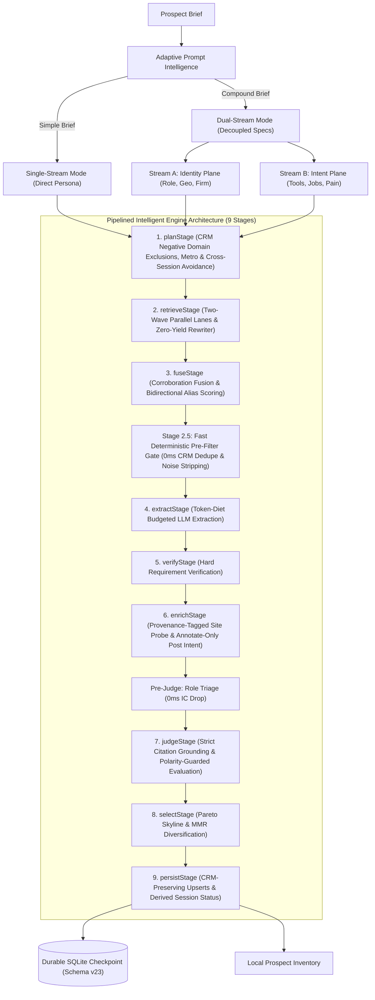
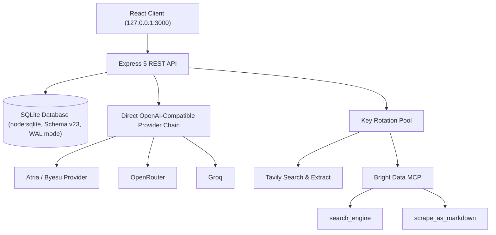

<div align="center">
  <h1>Apex CRM</h1>
  <p><strong>Local-first, evidence-grounded prospect scouting and CRM for LinkedIn-first workflows</strong></p>

  <p>
    
    
    
    
    
    
  </p>
</div>

---

## What Apex CRM is

Apex CRM is a single-user, local-first application for finding relevant prospects, collecting their LinkedIn profile links, reviewing verifiable evidence behind each match, and keeping the resulting list organized.

Its primary workflow is intentionally practical:

1. **Describe your search brief** in natural language (2-word vague to 100-word rich, any vertical, any geography).
2. **Query Understanding Layer** (`queryUnderstanding.ts`) classifies your brief:
   - `vague | standard | rich` with ambiguity score and missing-slot detection (`role`, `geo`, `industry`, `seniority`, `signal`).
   - **Zero default-invention**: briefs with no geography search globally -- no synthetic `USA`/US-metro tokens are injected.
   - Simple persona briefs run direct high-recall discovery with zero LLM overhead.
   - Long-shot intent briefs decouple into **Stream A (Identity)** for 100% SERP recall and **Stream B (Intent Triggers)** for multi-channel open-web research.
3. **Stage-Pipelined High-Efficiency Engine**:
   - Executes **Two-Wave Parallel Retrieval** across Tavily and Bright Data simultaneously, with vagueness-aware depth (`vague: 20 + advanced recall`, `rich: precision-tuned`) and a bounded **complexity-aware query rewriter** (`queryRewriter.ts`) as second-chance zero-yield recovery.
   - Applies **Fast Deterministic Pre-Filter Gate** to discard CRM duplicates and non-compliant profiles in 0ms without invoking extraction LLMs.
   - Enforces **Sequential LLM Execution** (`withSequentialLLMExecution`) by default to eliminate concurrency errors and provider 429/524 timeouts; optionally shards into stage lanes (`strategist | extraction | judge`, max 2 each, global cap 4) behind `FEATURE_LLM_STAGE_QUEUES=true`.
   - Matches with **alias-first normalization** (`aliasMap.ts`): `MD`, `VP`, `US`/`USA`, ISO regions resolve in 0ms with no network calls.
4. **Signal-to-Company Reverse Flywheel**: Discovered hiring/tooling triggers on the open web immediately feed prioritized executive search queries.
5. **Multi-Source Intent Enrichment**: Analyzes company websites (**TF-IDF Intent**) and public prospect activity (**LinkedIn Post SERP Intent with Temporal Freshness Decay**).
6. **Durable Checkpoints & Resiliency**: Saves stage-boundary SQLite snapshots (`checkpoint_json`), allowing any interrupted search to be resumed with 1 click.
7. **Revision Conflict Resolution**: Interactive side-by-side conflict dialog protects lead edits from background task collisions.
8. **Review & Manual Outreach**: Review evidence-grounded matches, certainty scores, and contact details, then reach out manually on LinkedIn.

---

## Prospect Discovery Engine


```mermaid
flowchart TD
    Brief["Prospect Brief"] --> Classifier["Adaptive Prompt Intelligence"]
    Classifier -->|Simple Brief| StreamIdentity["Single-Stream Mode (Direct Persona)"]
    Classifier -->|Compound Brief| StreamDual["Dual-Stream Mode (Decoupled Specs)"]
    StreamDual --> StreamA["Stream A: Identity Plane (Role, Geo, Firm)"]
    StreamDual --> StreamB["Stream B: Intent Plane (Tools, Jobs, Pain)"]

    subgraph Stages ["Pipelined Intelligent Engine Architecture (9 Stages)"]
        Plan["1. planStage (CRM Negative Domain Exclusions, Metro & Cross-Session Avoidance)"]
        Retrieve["2. retrieveStage (Two-Wave Parallel Lanes & Zero-Yield Rewriter)"]
        Fuse["3. fuseStage (Corroboration Fusion & Bidirectional Alias Scoring)"]
        PreFilter["Stage 2.5: Fast Deterministic Pre-Filter Gate (0ms CRM Dedupe & Noise Stripping)"]
        Extract["4. extractStage (Token-Diet Budgeted LLM Extraction)"]
        Verify["5. verifyStage (Hard Requirement Verification)"]
        Enrich["6. enrichStage (Provenance-Tagged Site Probe & Annotate-Only Post Intent)"]
        PreJudge["Pre-Judge: Role Triage (0ms IC Drop)"]
        Judge["7. judgeStage (Strict Citation Grounding & Polarity-Guarded Evaluation)"]
        Select["8. selectStage (Pareto Skyline & MMR Diversification)"]
        Persist["9. persistStage (CRM-Preserving Upserts & Derived Session Status)"]

        Plan --> Retrieve --> Fuse --> PreFilter --> Extract --> Verify --> Enrich --> PreJudge --> Judge --> Select --> Persist
    end

    StreamIdentity --> Plan
    StreamA --> Plan
    StreamB --> Plan

    Persist --> Checkpoint[("Durable SQLite Checkpoint (Schema v23)")]
    Persist --> Inventory["Local Prospect Inventory"]
```

### Key Architectural Capabilities

#### 1. Two-Wave Concurrent Parallel Retrieval Lanes

- **Wave 1 (Parallel Dispatch)**: Executes all unconditional Tavily and Bright Data queries concurrently via `Promise.all([executeTavilyLane(), executeBrightDataLane()])`.
- **Wave 2 (Conditional Supplemental)**: Settles Wave 1, evaluates Tavily yield, and triggers supplemental Bright Data fallback searches only when Tavily yield is low (`< 5`), preserving 100% of hybrid-mode credit policies.
- **Zero-Yield Rewriter Dispatch**: Dispatches complexity-aware zero-yield rewrites (`queryRewriter.ts`) across both credit-reservation and standard execution paths, threading `demotedRequirementId` into coverage tracking while protecting Tier-1 immutable identity anchors (`person_role`, `company_type`, `industry`) from being dropped.
- **Safety & Error Isolation**: Shared abort signals, race-free in-task credit reservations, and per-task error containment.

#### 2. Synchronous State-Bounded Planning

- Search planning is evaluated synchronously at each round boundary with verified knowledge of current lead yield and candidate counts.
- `planStage` stays pure and deterministic: queries and stats are committed to session state strictly at round boundaries, preventing state pollution on early exits.

#### 3. Durable Checkpoints & Session Resumption (ADR-0002)

- **Stage Boundaries**: Persists a compact Tier-A snapshot (`MiningSessionCheckpoint`) to SQLite `checkpoint_json` after each round's enrichment stage and before judging.
- **Boot Sweep**: Automatically reconciles orphaned sessions on server restart into `resumable` status.
- **One-Click Recovery UI**: `ResumableSessionsBanner` in the UI alerts users of interrupted searches and resumes them from checkpoint with zero duplicate queries.
- **Dual-Mode HTTP**: Supports synchronous HTTP 200 execution or immediate HTTP 202 Accepted (`?mode=job` / `Prefer: respond-async`) with SSE stream URLs.

#### 4. Interactive Lead Revision Conflict Resolution (B2 Dialog)

- **Revision Locking**: Optimistic concurrency on `leads.revision`.
- **Side-by-Side Diff Modal**: Caught `LeadPatchConflictError` (HTTP 409) prompts the user with an interactive diff comparing local edits vs. server updates.
- **Three Resolution Pathways**:
  - _Overwrite With My Changes_: Applies local edits with the current server revision.
  - _Accept Server Version_: Discards local dirty state and syncs server canonical.
  - _Smart Merge_: Field-level union of changes and tags.

#### 5. High-Frequency Streaming Trace Store

- Built on React 18/19's `useSyncExternalStore` (`miningTraceStore`).
- Telemetry events and terminal logs stream into an isolated `<TraceTerminal>` outside React's render tree, eliminating layout shifts and typing lag during fast search rounds.

#### 6. Multi-Source Intent Research & Freshness Decay

- **Phase 4 (Company Website TF-IDF)**: Scrapes company websites against categorized intent dictionaries with session-scoped IDF corpus weighting.
- **Phase 5 (Annotate-Only LinkedIn Post SERP Intent)**: Queries Google for indexed prospect post snippets (`site:linkedin.com/posts <handle>`), classifies intent categories (`hiring`, `evaluating_tools`, `pain_signal`, `growth_signal`), and annotates selected finalists in map order without re-sorting or cutting the shortlist.
- **Temporal Freshness Decay**: Parses full and abbreviated SERP snippet recency markers (`"2 days ago"`, `"3 weeks ago"`, `"2d ago"`, `"1w ago"`, `"3mo ago"`, `"1y ago"`, `"2h ago"`) and applies exponential half-life decay ($e^{-0.02 \times \text{days}}$). Undated snippets default to a neutral 45-day age (`UNKNOWN_AGE_DAYS = 45`) so undated text never receives a synthetic recency boost.

#### 7. Domain-Clustered Multi-Armed Bandit & Dynamic Search Strategy (ADR-0003 & ADR-0006)

- **Domain Clustering**: Partitions cross-session MAB query performance by domain cluster (`b2b_agency`, `b2b_saas`, `executive_coaching`, `local_services`, `healthcare_life_sciences`) so agency learning does not pollute SaaS searches.
- **Closed-Loop Outcome & Hard-Fail Weighting**: Incorporates binary disposition outcomes (`lead_outcomes`: `KEEP`, `VERIFIED`, `CONVERTED`, `MEETING BOOKED`, `REPLIED` vs. `REJECT`, `LOST`, `UNQUALIFIED`) via `readOutcomeRate()` and penalizes `hard_failed_candidates` in Thompson-sampling posteriors.
- **Exponential Moving Average Decay ($\lambda = 0.95$)**: Automatically downweights stale historical query metrics on every conflict update, allowing newly adapted strategies to emerge.
- **Dynamic Semantic Query Fallback**: Synthesizes bounded (`<= 60` char signal), non-colliding fallback queries using domain synonyms, tooling keywords, and pain signals directly from the compiled contract. City-only geographies (`London`, `Berlin`) anchor queries without allowing the vertical slot to equal the location, and 2-char pronoun collisions (`us`, `me`, `am`, `in`) require explicit prepositional or uppercase cues.

#### 8. Entity Intelligence, Strict Grounding & High-Fidelity Site Probing (ADR-0003 & ADR-0006)

- **Strict Evidence Citation Grounding (`EVIDENCE_GROUNDING_MODE=strict`)**: Requires every LLM `pass` verdict on a contract requirement to cite a resolvable evidence passage verified by exact, symmetrical bidirectional alias (`aliasIncludes`), or polarity-guarded fuzzy matching (`0.7 * windowOverlap + 0.3 * setOverlap`, rejecting windows containing stray negators like `not`, `no`, `never`, `former`). Ungrounded passes degrade to `unknown` (`fabricatedPass`), while explicit hard-requirement failures always take precedence as `hard_fail`.
- **Location Provenance & Press-Link Guard**: Company website locations are tagged with `_locationProvenance = 'company_site'` so headquarters addresses never auto-pass `person_location` requirements. Evidence-extracted URLs must share identity tokens with the company name (`urlHostSharesCompanyToken`) before probing, preventing press articles (e.g. TechCrunch) from being scraped as company homepages.
- **Career Trajectory DCR & Plural Persona Matching**: Models Partners, Fractional CXOs, Practice Leads, RevOps/GTM Heads, and Principal Consultants with exponential role recency decay, and matches plural persona briefs (`CEOs`, `Presidents`, `VPs`) without leaking role terms into `company_type`.
- **Company-Scoped Contradiction Gates**: Scopes `b2b_saas` contradiction checks in `profileQuality.ts` to company and industry fields so past-career bio mentions do not false-fail valid founders.
- **Global Corporate Form Normalization**: Strips international corporate suffixes (`S.R.L.`, `S.A.S.`, `S.L.`, `AG`, `Pte Ltd`, `Sdn Bhd`, `Sp. z o.o.`, `ApS`, `Pty Ltd`) and regional branch designations (`EMEA`, `APAC`, `Global`, `Holdings`).

#### 9. Lean Adaptive Collection & Targeted Post-Selection Enrichment (ADR-0004)

- **Proportional Collection Capacity**: Calibrates candidate pool targets with a tight 1.15x-1.25x cushion (e.g. 25 candidates for a 20-lead target instead of 80-120).
- **Decoupled Early Exit**: Automatically terminates discovery rounds when verified candidate volume satisfies target limits, eliminating false-recovery round loops caused by keyword heuristics.
- **Targeted Post-Selection Enrichment**: Defers heavy company site probing (Phase 4) and LinkedIn post SERP intent (Phase 5) until after Finalist Judging and Pareto diversification, eliminating 70%+ of wasted network and LLM token overhead.

#### 10. Intelligent Low-Waste Filtering & Strict Sequential LLM Invariant (ADR-0005)

- **Stage 2.5 Fast Deterministic Pre-Filter Gate**: Immediately filters out known CRM duplicate leads using SQLite identity keys (`readExistingIdentityKeys`) in 0ms before extraction tokens are spent. Enforces personal LinkedIn anchors when the brief requires people, and strips ~65% of noise (HTML tags, cookie banners, navigation boilerplate) from snippets. If all retrieved candidates are duplicates or non-compliant, extraction exits in 0ms without invoking the LLM.
- **Upstream CRM Feedback, JSON Metro Saturation & Cross-Session Company Seeding**: Reads existing company domains, metro saturation counts (including SQLite JSON `$.profile.location` and `$.profile.city`), and cross-session `discovered_companies` (`readDiscoveredCompanyNames(25)`). Passes known domains directly into Tavily's `exclude_domains` parameter and directs the query strategist to pivot away from saturated hubs ($\ge 15$ leads) with negative search operators.
- **Deterministic Pre-Judge Role Triage**: Discards individual contributors (`intern`, `staff engineer`, `ml engineer`, `data scientist`, `recruiter`, `account executive`) in 0ms when the contract specifies leadership roles. Acronyms (`MD`, `VP`, `CTO`, `CRO`) are expanded before matching.
- **Pre-Judge Context Grounding**: Executes a lightweight, non-LLM site probe (~250ms) to fetch the root `<meta name="description">` or `<title>` for ambiguous accounts, appending verified business context before semantic evaluation.
- **Strict Sequential LLM Invariant**: All LLM calls are serialized via `withSequentialLLMExecution` by default, eliminating concurrency errors, rate-limit storms, and gateway timeouts. Stage-lane sharding (`FEATURE_LLM_STAGE_QUEUES=true`) allows bounded concurrency with per-provider backoff preserved.
- **Contract-Aware Calibrated Judging**: `rankLeadForFinalSelection` weights hard-requirement coverage (`1.2x` spread) with active soft-signal boost (`0.4x`); evidence quote checks are symmetrically alias-aware (`MD` <-> `managing director`, `US` <-> `United States`).
- **Quantized Adaptive Controller & Constraint Retention**: MAB priors pool by 24 deterministic brief centroids (`centroid_<cluster>_<00-23>`) with `historicalYield` keyed by `domain_cluster|family|lane|provider` and ` seedAdaptiveRandom` deterministic test support; `contract_guard` tasks are preserved above the `maxTasks+2` cap so hard-requirement coverage is never pruned.
- **CRM Workflow Preservation & Persistence Status Fidelity**: Same-identity engine upserts refresh objective profile and score attributes while preserving human-managed `stage`, `reviewStatus`, `nextAction`, and `notes` unless `forceOverwrite: true` is passed. Session and search-log statuses (`success | partial_success | error`) are derived from actual persistence counts rather than hardcoded.

---


## System Architecture


```mermaid
graph TD
    UI["React Client (127.0.0.1:3000)"] --> API["Express 5 REST API"]
    API --> DB[("SQLite Database (node:sqlite, Schema v23, WAL mode)")]

    API --> Direct["Direct OpenAI-Compatible Provider Chain"]
    Direct --> Primary["Atria / Byesu Provider"]
    Direct --> OpenRouter["OpenRouter"]
    Direct --> Groq["Groq"]

    API --> KeyRotator["Key Rotation Pool"]
    KeyRotator --> Tavily["Tavily Search & Extract"]
    KeyRotator --> MCP["Bright Data MCP"]
    MCP --> BDSearch["search_engine"]
    MCP --> BDScrape["scrape_as_markdown"]
```

### Technology Stack

- **Frontend**: React 19, Vite 8, Tailwind CSS 4, Motion, Radix UI, Lucide React, `useSyncExternalStore`.
- **Backend**: Node.js 24+, TypeScript 7, Express 5, `p-queue` rate limiting.
- **Persistence**: Built-in `node:sqlite` in WAL mode with transactional schema migrations (schema **v23**), optimistic revision locking, durable checkpoints, and automatic WAL-safe backups.
- **LLM Routing**: Direct OpenAI-compatible provider chain with automatic fallback (Atria / Byesu -> OpenRouter -> Groq), session circuit breaker, and retry logic.
- **Retrieval**: Multi-key rotating Tavily Search/Extract and Bright Data MCP (`search_engine`, `scrape_as_markdown`).

---

## Getting Started

### Prerequisites

- Node.js 24 or newer (for native `node:sqlite`).
- At least one OpenAI-compatible LLM endpoint/key.
- At least one search provider: Tavily or Bright Data (both recommended for hybrid discovery).

### Installation

```bash
npm install
```

Copy the configuration template:

```bash
cp .env.example .env
```

### Environment Configuration

A minimal `.env` setup:

```env
# Primary LLM Provider: Atria or Byesu/OpenAI-compatible
ATRIA_API_KEY="your_atria_api_key"
ATRIA_PRIORITY="primary"

# Secondary/Fallback OpenAI-compatible endpoint:
OPENAI_API_KEY="your_byesu_or_openai_key"
OPENAI_BASE="https://byesu.com/v1"
OPENAI_MODEL="gpt-5.5"
OPENAI_PROVIDER_NAME="Byesu"

TAVILY_API_KEYS='["tavily_key_1", "tavily_key_2"]'
TAVILY_API_KEY="tavily_key_3"

BRIGHTDATA_API_TOKENS='["brightdata_token_1", "brightdata_token_2"]'
BRIGHTDATA_API_TOKEN="brightdata_token_3"

DISCOVERY_PROVIDER_MODE="hybrid"
BRIGHTDATA_MCP_TRANSPORT="local"
```

### Running Locally

```bash
# Start Vite frontend and Express backend concurrently
npm run dev

# Or start only the backend server
npm run dev:server
```

Open `http://127.0.0.1:3000` in your browser.

### Production Build

```bash
npm run build
npm run start
```

---

## API Reference

All API routes are mounted under `/api`:

| Group               | Method & Route                            | Description                                                                                    |
| ------------------- | ----------------------------------------- | ---------------------------------------------------------------------------------------------- |
| **Health & Status** | `GET /health`                             | Application status and uptime                                                                  |
|                     | `GET /llm-health`                         | LLM gateway and provider latency status                                                        |
|                     | `GET /key-rotation-status`                | Sanitized provider key pool health                                                             |
|                     | `GET /provider-capabilities`              | Supported scraper and search features                                                          |
|                     | `GET /engine-metrics`                     | Aggregate engine health, stop reasons, and LLM stage latency                                   |
| **Discovery**       | `POST /lead-search/preview`               | Preview compiled contract and query plan                                                       |
|                     | `POST /find-leads`                        | Execute discovery session (supports synchronous HTTP 200 or async HTTP 202 via `?mode=job`)    |
|                     | `POST /scrape-url`                        | Scrape public web page markdown                                                                |
|                     | `POST /scrape-pasted`                     | Parse raw pasted text into prospect leads                                                      |
| **Mining Sessions** | `GET /mining-sessions`                    | List historical mining sessions                                                                |
|                     | `GET /mining-sessions/active`             | Get currently active mining session details                                                    |
|                     | `GET /mining-sessions/resumable`          | List interrupted sessions available for 1-click resumption                                     |
|                     | `DELETE /mining-sessions/resumable`       | Clear all interrupted resumable session checkpoints                                            |
|                     | `GET /mining-sessions/:sessionId`         | Get specific mining session details                                                            |
|                     | `DELETE /mining-sessions/:sessionId`      | Delete mining session record                                                                   |
|                     | `GET /mining-sessions/:sessionId/stream`  | High-frequency SSE execution trace and logs                                                    |
|                     | `GET /mining-sessions/:sessionId/trace`   | Telemetry trace events for session                                                             |
|                     | `GET /mining-sessions/:sessionId/token-stats` | Aggregate token consumption and costs                                                       |
|                     | `POST /mining-sessions/:sessionId/resume` | Resume interrupted mining session from checkpoint                                              |
|                     | `POST /mining-sessions/:sessionId/cancel` | Cancel active mining run                                                                       |
| **Search Logs**     | `GET /search-logs`                        | Query performance and cost summaries                                                           |
|                     | `GET /search-logs/:id`                    | Retrieve individual search log by ID                                                           |
|                     | `GET /search-logs/:id/live`               | Live log stream for active search                                                              |
| **Prospects & CRM** | `GET /leads`                              | List stored prospects with filtering, pagination, and fast summary path                        |
|                     | `GET /leads/stats`                        | Total lead counts and stage distribution metrics                                               |
|                     | `PUT /leads`                              | Atomic replacement of stored leads collection                                                  |
|                     | `POST /leads/bulk`                        | Bulk insert or update prospect records with per-item revision conflict detection               |
|                     | `PATCH /leads/:id`                        | Update lead stage, review status, or notes (requires revision integer; returns 409 on conflict) |
|                     | `DELETE /leads/:id`                       | Soft-delete or archive prospect                                                                |
|                     | `DELETE /leads`                           | Clear all stored leads and identities                                                          |
|                     | `POST /leads/:id/merge`                   | Merge duplicate prospect into primary lead with conflict resolution and relation reassignment  |
|                     | `POST /leads/:id/enrich-profile`          | Enrich specific lead via Bright Data profile unlock                                            |
|                     | `GET /leads/:id/activities`               | Audit trail activities for prospect                                                            |
| **Saved Searches**  | `GET /saved-searches`                     | List saved search specifications                                                               |
|                     | `POST /saved-searches`                    | Create or update saved search                                                                  |
|                     | `DELETE /saved-searches/:id`              | Delete saved search                                                                            |
| **Outreach**        | `GET /outreach-drafts`                    | List stored outreach drafts                                                                    |
|                     | `POST /outreach-drafts`                   | Create or update outreach draft                                                                |
|                     | `DELETE /outreach-drafts/:id`             | Delete outreach draft                                                                          |
|                     | `POST /generate-outbound`                 | Generate contextual outreach message                                                           |
|                     | `POST /chat`                              | CRM conversational assistant                                                                   |

---

## Database & Schema (v23)

The default database is `.apex-data/apex-crm.sqlite`. SQLite runs in WAL mode with foreign keys enabled and busy timeouts configured.

### Schema Capabilities:

- **`leads`**: Core prospect records, LinkedIn canonical identities, matched criteria, postIntentEvidence, uncertainty scores, and revision locks.
- **`mining_sessions`**: Durable execution sessions, target progress, phase summaries, and stage-boundary **`checkpoint_json`** snapshots.
- **`search_logs` / `llm_stage_logs`**: Granular event streams and per-stage LLM telemetry for real-time observability.
- **`query_performance`**: Historical yield, latency, and provider unit accounting per query family and lane.
- **`prospect_contract_cache`**: Versioned requirement contracts, decomposition modes, and compilation metadata.
- **`enrichment_cache`**: Positive and negative profile scraping caches (incl. intent fingerprints).
- **`llm_completion_cache`**: Prompt-hash-keyed LLM completion cache with TTL, cutting repeat strategist/extraction latency across rounds.
- **`discovered_companies`**: Signal-to-company reverse flywheel account inventory with attribution metadata.
- **`lead_outcomes`**: Per-lead disposition labels feeding quality grounding (ADR-0006).
- **`icp_hypothesis_cache`**: Cached ICP hypothesis decompositions for repeat brief shapes.
- **`saved_searches`**: Reusable prospecting configurations.
- **`lead_activities` & `outreach_drafts`**: Audit trails and draft messaging.

Automated backups are created under `.apex-data/backups/` before schema migrations run.

---

## Verification & Testing

Apex CRM maintains an extensive test suite (129 test files: 128 unit/integration suites with 860 tests across 172 suites + 1 evaluation harness with 13 tests, run via `tsx --test`), including the Phase 0 intelligence eval harness (`test/queryIntelligence.eval.ts`, 30+ gold briefs) and stage-queue concurrency tests (`test/llmStageQueue.test.ts`):

```bash
# Typecheck (0 errors)
npm run typecheck

# Full test suite (860 tests across 172 suites, 100% pass)
npm test

# Query Intelligence Eval Harness (13 tests across 30+ gold briefs)
npm run test:eval

# Full Lead Engine Suite
npm run test:lead-engine

# Quote Grounding, Slug Probe & Cache Hygiene Suite
npm run test:optimizations

# UI Contracts, Navigation & Trace Store (16 tests)
npm run test:ui

# Adaptive Decomposition & Multi-Source Intent Suite (34 tests)
npm run test:intent-engine

# Persistence, Identity Deduplication & Revisions
npm run test:dedupe
```

---

## Project Structure

```text
docs/
  CODEBASE_INDEX.md          Measured architecture, module inventory, and audit ledger
  adr/                       Architecture Decision Records (ADR-0001 through ADR-0006)
src/
  components/                React UI components, modals, tables, badges
    ConflictDialog.tsx       Interactive B2 lead revision conflict resolution dialog
    ResumableSessionsBanner  1-click interrupted mining session recovery banner
    TraceTerminal.tsx        Decoupled 60fps streaming telemetry terminal
  context/                   React context providers (leads, toasts)
  lib/
    traceStore.ts            useSyncExternalStore reactive SSE trace and log store
    leadMutations.ts         Optimistic rebase and canonical preference utilities
  types.ts                   Shared TypeScript types and contract definitions
  utils/                     Deduplication, normalization, and UI formatting
server/
  routes/
    api.ts                   REST API endpoints, dual-mode HTTP 202, outcome feedback, and resume routes
  services/
    llm.ts                   LLM gateway, completion cache, fallbacks, JSON schemas, and Tavily search/extract
    brightdata.ts            Bright Data MCP client, search, and scraper
    keyRotator.ts            Provider key pool and rate-limit manager
    linkedinEvidence.ts      LinkedIn profile evidence extraction
    privateHosts.ts          Shared SSRF guard for private/internal hosts
    sessionStreamHub.ts      Fan-out hub for SSE session streams
  leadSearch/
    stages/                  Decoupled 9-stage pipeline engine
      planStage.ts           Adaptive planner task derivation & query planning (resolveGeo, cluster MAB, cross-session companies)
      retrieveStage.ts       Two-Wave parallel retrieval execution (vagueness-aware depth + queryRewriter rescue)
      fuseStage.ts           Observation normalizer & corroboration fusion (symmetrical alias scoring)
      extractStage.ts        Stage 2.5 pre-filter gate & budget-capped LLM extraction
      verifyStage.ts         Deterministic requirement verification
      enrichStage.ts         Provenance-tagged site probe, TF-IDF company intent & annotate-only post intent
      judgeStage.ts          Strict-grounding 3-Tier Finalist Judge & pre-judge role triage
      selectStage.ts         Pareto skyline & MMR diversification
      persistStage.ts        CRM-preserving identity upserts & derived session status
    discoveryEngine.ts       Discovery Session Engine orchestrator & stage pipelining (parentSessionId/deltaBrief/interactive)
    prospectContract.ts      Contract schema, prompt intelligence & decomposition (plural-persona, alias-aware grounding, no geo invention)
    queryUnderstanding.ts    Complexity classifier (vague/standard/rich), resolveGeo (pronoun guard), salience compression
    aliasMap.ts              Symmetrical bidirectional role/geo/company/tool alias normalization for hot loops
    queryRewriter.ts         Bounded complexity-aware zero-yield rewriter (Tier-1 immutable anchor protection, max 3)
    intentSignals.ts         Dynamic signal compiler, categories & freshness decay (abbreviated units, 45d neutral undated age)
    companyIntent.ts         Phase 4 company website TF-IDF intent scoring
    companyAttribution.ts    Gated company-to-prospect LLM attribution & business-model contradiction gating
    profileQuality.ts        Deterministic social-proof parsing, ghost/company-page & company-scoped contradiction detection
    linkedinPostIntent.ts    Phase 5 annotate-only LinkedIn post SERP intent research
    providerQueue.ts         Bounded-concurrency provider task queue (`runProviderQueue`)
    collectionCapacity.ts    Candidate batch sizing and target-scaled ceilings
    scoring.ts               Composite scoring, freshness decay & MMR diversity
    telemetry.ts             Cost, token, and execution logging
  db.ts                      SQLite v23 schema (incl. lead_outcomes, llm_completion_cache, leads_fts), migrations, checkpoint CRUD & startup sweeps
test/                        Automated unit, integration, replay, and eval test suites (129 files via tsx --test)
scripts/                     Dev orchestrator (`scripts/dev.ts`)
.env.example                 Configuration variables and default settings
```

---

<div align="center">
  <i>Built for careful, evidence-grounded prospect research.</i>
</div>
